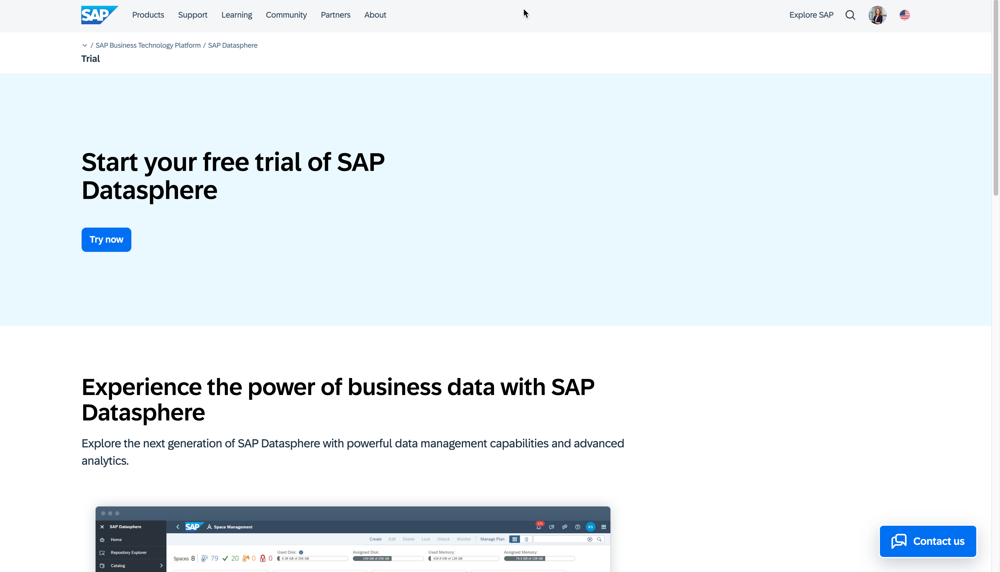
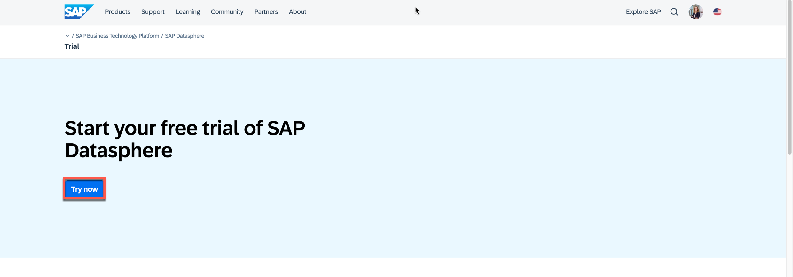
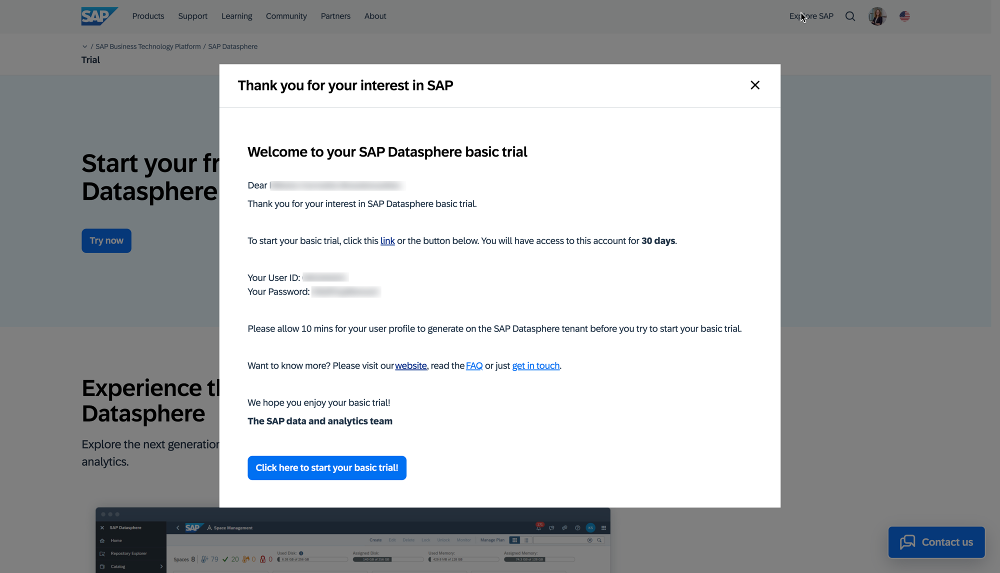
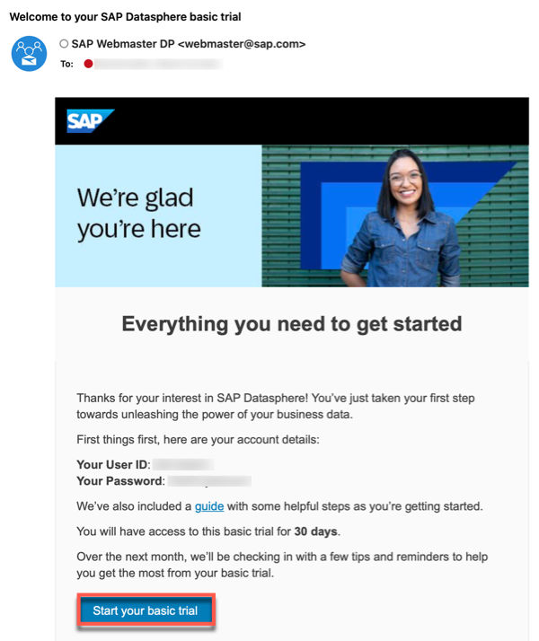
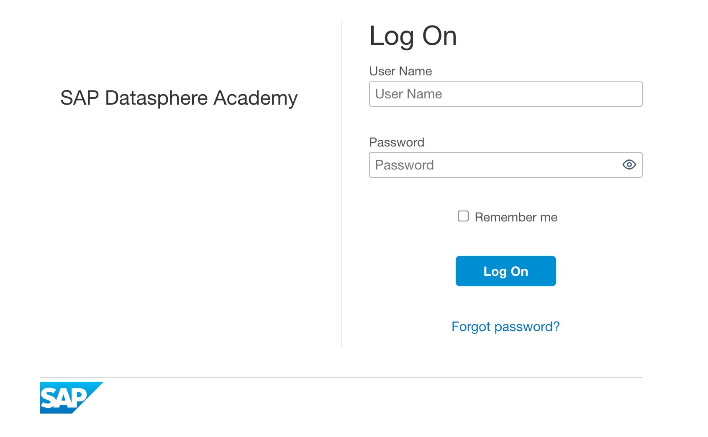
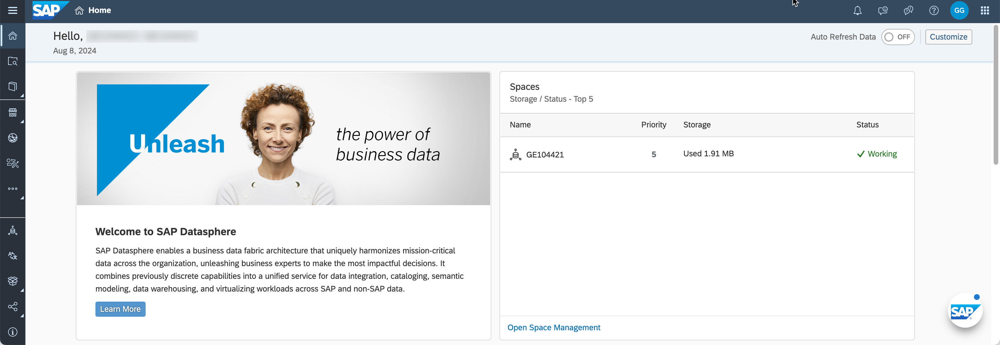

# Get your basic trial access 

First you need to get your basic trial access of SAP Datasphere (mandatory). You could use any SAP Datasphere system you have access to, as all the required files for the core exercises are provided as part of this GitHub repository. 

1.	Navigate to the SAP Datasphere product page on sap.com about the basic trial:   https://www.sap.com/products/technology-platform/datasphere/trial.html
   

*** SCREENSHOTS NEED UPDATE ***

2.  Click on ***Start now*** or alternatively use the follwing link  https://www.sap.com/registration/trial.4d48ec23-eadf-4399-8595-ac3f9c66c64f.html 

3.  The registration form will show up. Please provide your email address proceed using the ***NEXT*** button.  

---

> :bulb: Tip: If you are new to SAP, proceed providing the required information in the form. 

---

 

4.  You then get an email to finalize you account. Activate your account by clicking on the button ***CLICK TO ACTIVATE YOUR ACCOUNT***

 
  
  Enter a password and click ***SUBMIT***.
   
  
5.  In case you already have a universal ID, you are asked to provide your existing password.
 

6.  Now your login details (user ID and password) are shown to you. 

 

  You will also get an email with the same information

 

7.  You can login into your guided experience trial tenant using the login details and the URL you have received.

 

8.  After a successful login you get to the welcome screen.

 

## Summary

Now that you have a guided experience trial system available, lets get started with the hands-on exercises.

Continue with [Your First Log On](../ex00/README_FirstLogon.md)
