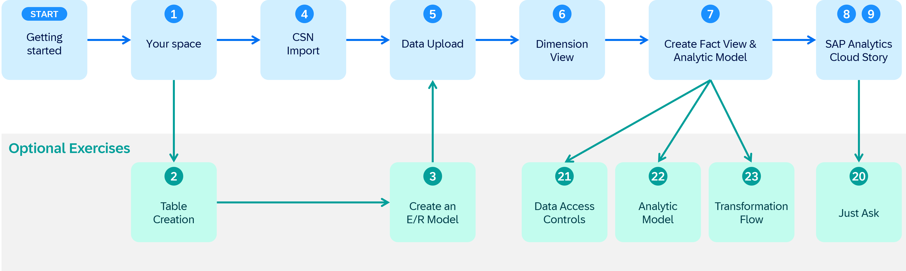

# Exercise Overview

********************************************************************
*** NEEDS UPDATE ONCE WE HAVE A FINAL SET OF EXECRISES + GRAPHIC ***
********************************************************************

We structured the overall exercise the following way:  
   * Use the blue path to finish early and enjoy exploring the system on your own
   * You can learn more and use the **Optional Exercises** for deep dives on different topics
  
 
    
### Let us give you a brief introduction on what can you expect in the different parts of the exercise.
  

## 1. **Getting Started**
   
   In this area you get an [overview about the business scenario & the data model](README.md) used throughout the exercises.
   
   We also give you guidance how to [get your basic trial access](README_GuidedTrial.md) in case you do not have access to a SAP Datasphere system already. 
   
   If you have never touched an SAP Datasphere system you can get an overview about your [first log on](../README_FirstLogon.md) and how you navigate in the system. 
	
## 2. **SAP Datasphere**
   
   This section covers the main modeling exercises where you prepare tables, views and an analytic model to build the foundation for the stories in SAP Analytics Cloud.

   In the first exercise [Get to know your own Space](../ex01/README.md) you learn more about Spaces and the ***Time Dimension*** required for your modeling in later parts of the exercise.
	  
   You can [manually create the tables](../ex02/README.md) and the [entity relationship model](../ex03/README.md), or directly generate the tables and ER model by using the [importing the tables](../ex04/README.md) provided with the [CSN file](https://cap.cloud.sap/docs/cds/csn) called *Sales_ER_Model.json*.
   
   Then you populate the tables with data by [uploading data files](../ex05/README.md) using the CSV files from the ZIP file. Based on these tables you then [create a dimension view](../ex06/README.md) as well as an [fact view and an analytic model](../ex07/README.md).
	
## 3. **SAP Analytics Cloud**

   In this part you will create simple stories in SAP Analytics Cloud to learn how to visualize your data based on a live connection to SAP Datasphere. The first story shows a [Top 10 Revenue Generating Products](../ex08/README.md) and the second the [Revenue by Geography](../ex09/README.md). Both require the previous exercises to be completed up to exercise 08. 
   
## 4. **Optional Exercises**
      
   These exercises are all optional and you can learn how to 
* leverage Just Ask with SAP Analytics Cloud to [Identify Top Sales Managers with Just Ask](exercises/ex20/README.md) 
* enable row-level security with Data Access Controls by [Creating Row-Level Permissions based on External Hierarchy](exercises/ex21/README.md) 
   
* [explore more features of the Analytic Model](exercises/ex22/README.md) 
	
* and learn about Transformation Flows by [Creating a Transformation Flow and the usage of delta tables ](exercises/ex23/README.md) 

## Summary

Now that you have a good understanding of the exercises, lets get started with the hands-on part.

Continue with [Overview about the business scenario and the data model](../ex00/README.md)
