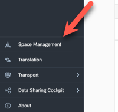
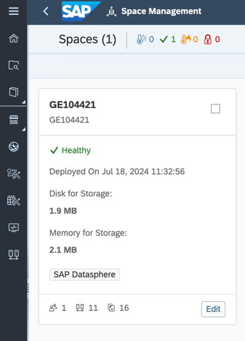
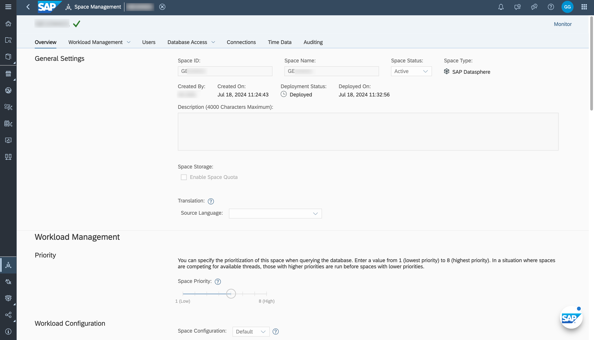
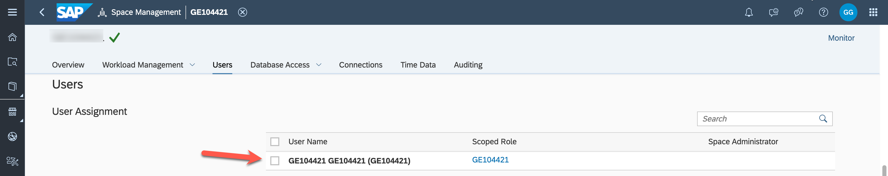
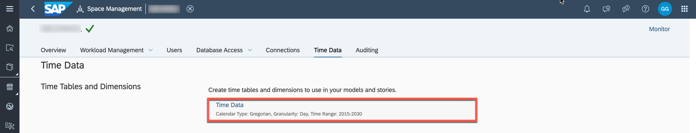

# Exercise 1: Get to know your own Space

> :memo: **Note:** This is an optional exercise.

---

## :beginner: Detour: SAP Datasphere - Spaces

Spaces as part of the SAP Datasphere solution are virtual team environments where your administrator has the ability to assign users and roles, as well as additional resources, connections to data sources, and allocated storage.  
In SAP Datasphere all data related workflows start with the selection of a space, so you can see the space is a fundamental concept. Users can share tables and view to another space to allow users assigned to that space to use it as a source for their objects.

## End of Detour
 

## Get to know your own Space

---

> :boom: **Important:** :boom:  
> In case you do not use a guided experience trial system for this hands-on training, then you require a space on the SAP Datasphere tenant you are using. 

---

1. In the menu on the left-hand side, select the option ***Space Management***.
 

2. After you selected the menu item, you will be presented with a list of existing spaces.
 

3. Click the ***EDIT*** button on your assigned space. 
The pre-defined spaces are usually named the same way as your user ID for example GE12345. The technical ID is identical to the space name. 
 

4. You are now being presented with the properties of your space and the abilities to configure certain options.  Changing the storage assignment or workload management options is not possible in guided experience trial systems. 

5. In the "Users" section you can see that your user (e.g. GE12345) is already assigned to the Space.
 

6. The **Time Data** section shows that time table and dimensions have already been created in your space. They provide standardized time data which we will use later as part of our model to create a date hierarchy. If you are using an own Datasphere tenant, please create the Time Tables and Dimensions.
 

## Summary

You have explored the settings of your space in SAP Datasphere. You can now start your next step and create your first data model.

Continue to - [Exercise 02: Prepare Your Data (optional) ](../ex02/README.md)
