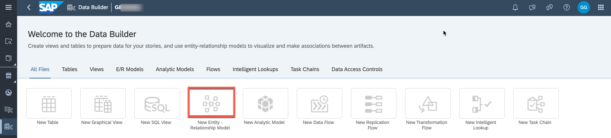
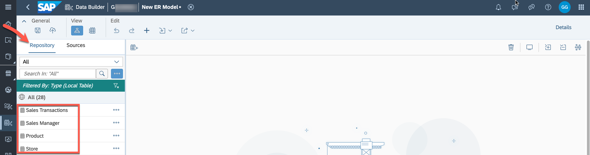
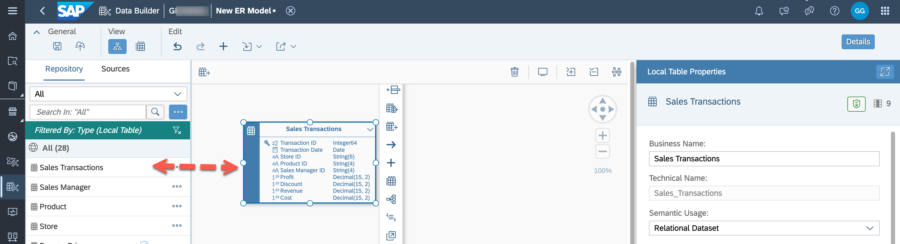
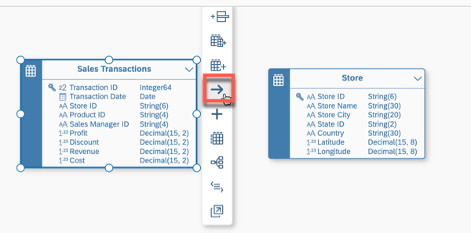
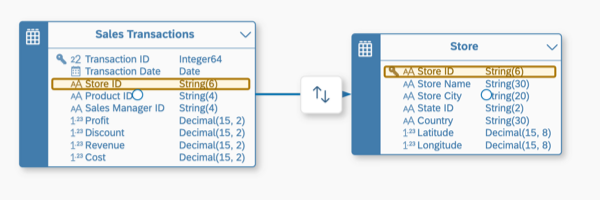
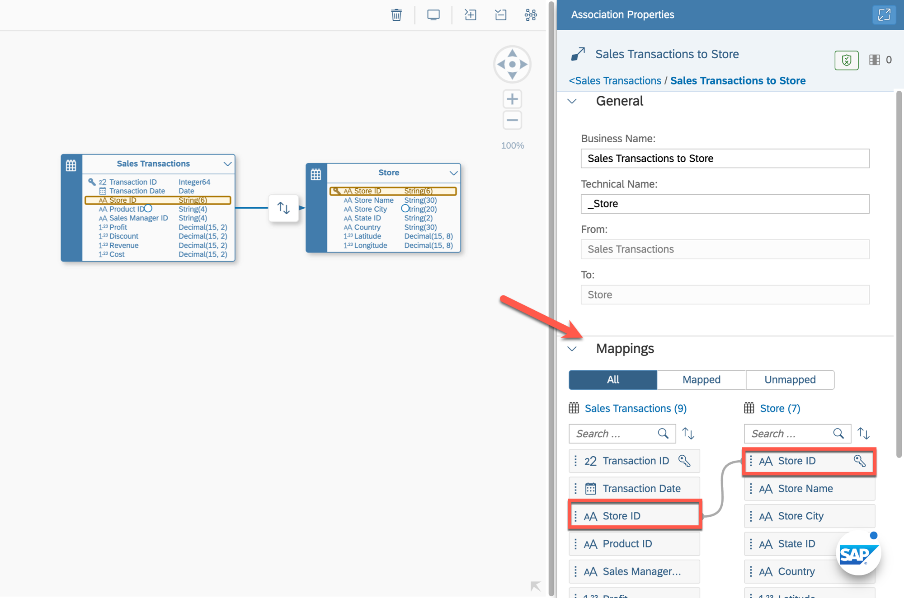
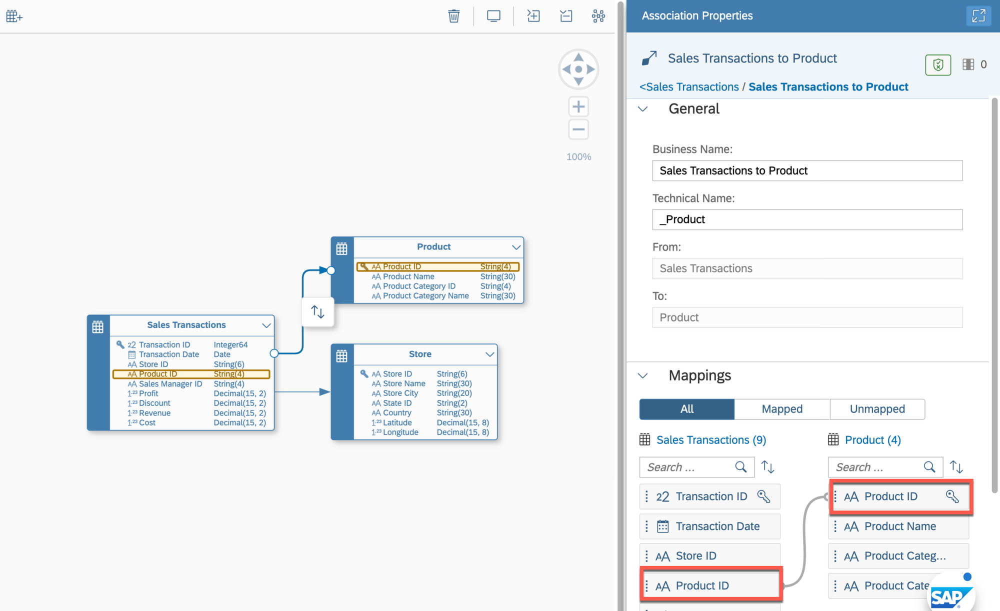
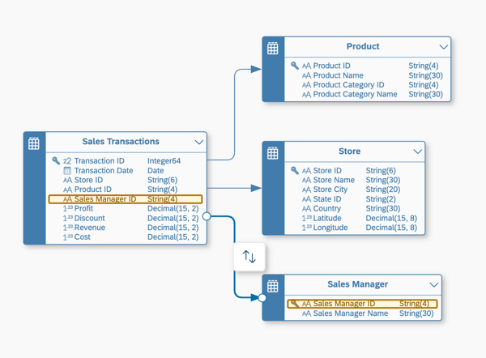
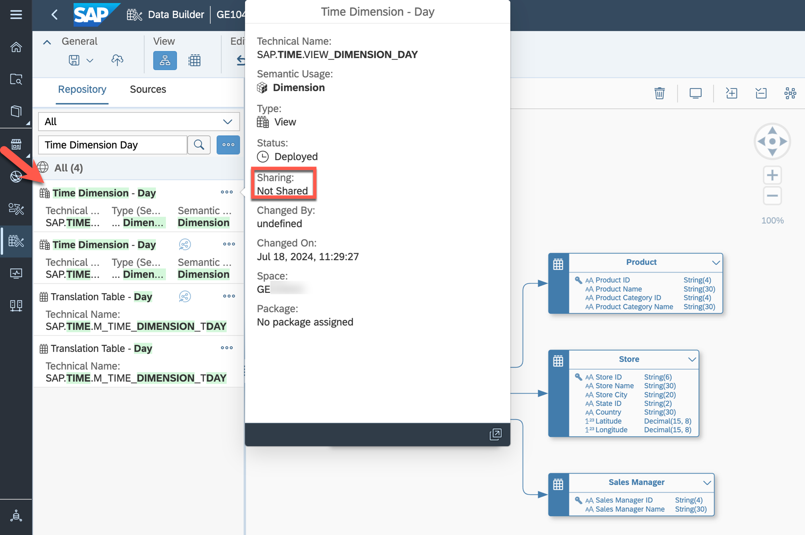
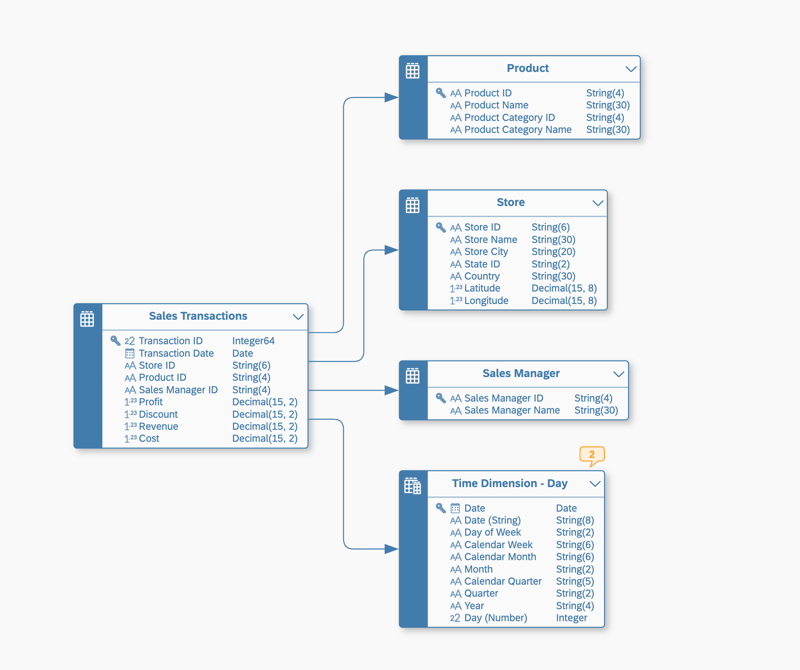

# Exercise 3 - Creating the Entity-Relationship Model

>:memo: **Note:** This is an Optional Exercise

## :beginner: Detour: SAP Datasphere - Entity-Relationship Model

Let us clarify what an Entity-Relationship model is and why we are creating it, before we start the exercise.

An Entity-Relationship Model provides a variety of benefits:
- Definition of entity-relationship models

- Design physical or remote database models

- Re-use existing entities (table, view) from Data Builder

- Add new entities on-the-fly

- In-editor real time data preview

- Model Import / Export

Basically, the Entity-Relationship Model is not a view that you would consume in SAP Analytics Cloud, but instead it represents the relationship between the tables or views, and it helps you to define the relationship once, so that you can reuse those when creating a new view.

Maintenance of associations and other capabilities of the E/R Model (like definition of semantic properties) can also be done in the table/view editor. Rules for creating associations depend on the Semantic Usage. The advantage of the E/R Model is that multiple entities can be modified at the same time while being visualized as diagram.

## End of Detour

## Create a new Entity-Relationship Model

1. Log On to your SAP Datasphere tenant.
2. Select the menu option Data Builder on the left-hand side
3. Select the option ***New Entity - Relationship Model***.
  

4. On the left-hand side you are presented with the local tables and views from your Repository. You also
have the option to bring in tables from any remote sources configured.
5. Ensure to select the option ***Repository***, so that you see the entities available. You should see the four tables that you created previously.
    
  
6. Now drag and drop the table ***Sales Transactions*** to the canvas.
  

7. When you select the table ***Sales Transactions*** on the canvas, you are presented with various additional options. You could add a new column, create a new entity (view or table), create a new asssociation, add related entities, preview the data, analyze impact and lineage, modify the custom entity annotations or open the table in the table editor.

8. Now drag and drop the table ***Store*** to the canvas next to the table ***Sales Transactions***.
9. Select the table ***Sales Transactions***.
10. Use the ***"->"*** symbol to create a new association.
 

11. Drag the ***arrow icon*** to table ***Store*** to create a new association between the table ***Sales Transactions*** and the table ***Store***.
  

12. The ***Association Properties*** panel defines the mapping of the columns for the association. Ensure that the join between the table ***Sales Transactions*** and ***Store*** is based on column ***Store ID (STORE_ID)***. The system suggests this based on matching columns, but you can also add / remove these joins manually.
  

13. Now drag the table ***Product*** onto the canvas.
14. Select the table ***Sales Transactions*** on the canvas. Drag and drop the ***arrow symbol*** to the table ***Products*** to create a new association between the table ***Sales Transactions*** and table ***Product***. Ensure that the join is based on the ***Product ID (Product ID)*** column.
  

15. Now drag the table **Sales Manager** onto the canvas.
16. Create a new association between the tables **Sales Transactions** and **Sales Manager**. Ensure that the join is based on the Sales Manager ID (Sales Manager ID) column.
  

17. We want to associate our sales transactions with the time data created in the space so that we can later drill down and up in hierarchies (for example setting the granularity to day or quarter). On the left hand side, search for "Time Dimension Day". Select the dimension of your space (not the one shared). You can verify that by clicking ***...*** and ***Show Info*** afterward. 
  

18. Drag the identified view ***Time Dimension – Day*** to the canvas.
19. Select the table ***Sales Transactions*** on the canvas.
20. Select the ***arrow symbol*** and drag and drop the arrow to the view ***Time Dimension - Day*** to create a new association between the table ***Sales Transactions*** and the view ***Time Dimension - Day***.
21. In the panel on the right-hand side (section ***Mappings***), create a join between the columns ***Transaction Date*** and ***Date***.
  

22. You can use the option ***Auto Layout*** in the toolbar to arrange all entities.
  

23. Your Entity-Relationship Model should look like the image shown below
  

24. Save the changes to your Entity-Relationship Model by using the ***Save option*** in the General menu.
25. Enter the following details: <ul><li>Business Name - Sales Model - Entity-Relationship Model</li><li>Technical Name - Sales_ER_Model
   

26. Click ***Save***.
27. Deploy the model.

## Summary

You've now created the Entity-Relationship Model to arrange the tables and the time dimension view in relation to one another. You could have also defined the associations in the individual table/view editors, but the E/R Model provides the advantage modifying multiple entities at the same time and seeing them in relation to each other. We will make use of the defined relations the next steps.

Continue to - [Exercise 05: Uploading Data](../ex05/README.md)
