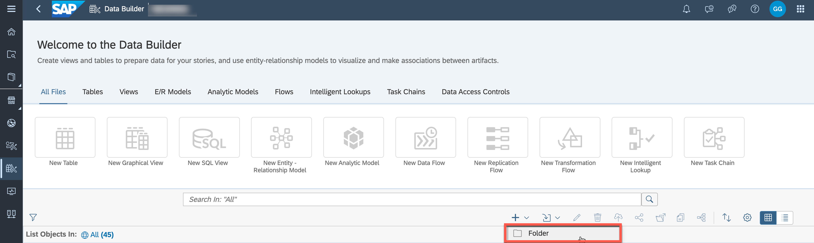
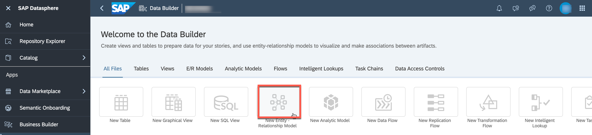
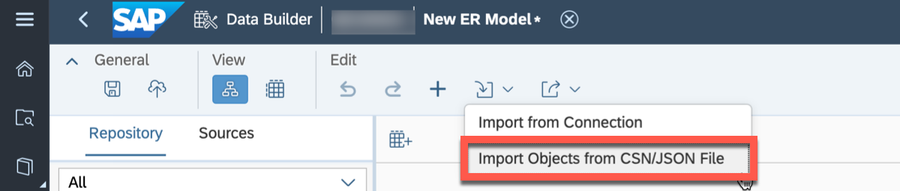
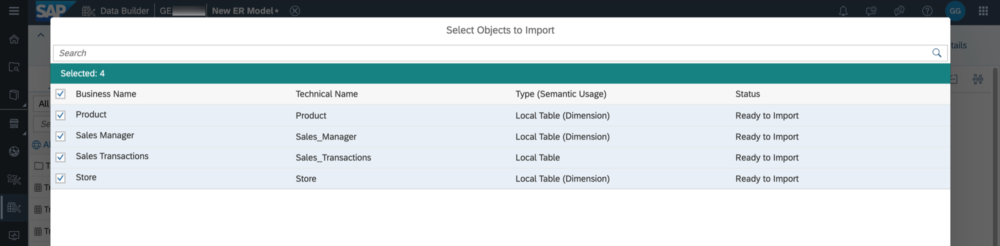
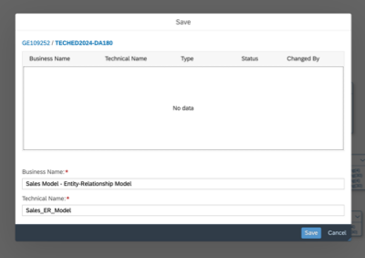
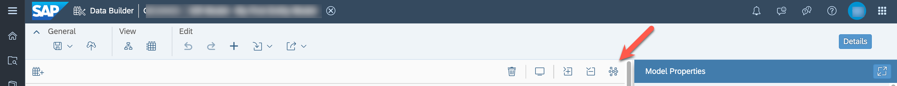

# Exercise 4 - Importing Tables

> :boom: **Important:** :boom:  
This exercise is only required in case you ***did not*** create the tables in [Exercise 02 - Prepare Your Data (optional) ](../ex02/README.md) and the Entity-Relationship Model for our sample model manually in [Exercise 03 - Creating the Entity-Relationship Model (optional) ](../ex03/README.md) and prefer to import them.

---

The file for this exercise is ***“Sales_ER_Model.json”*** and the file is part of the ZIP file you downloaded.
We will now import the table definitions in form of a JSON file by importing a Entity-Relationship Model.

1. Log On to your SAP Datasphere tenant.
2. Select the menu option ***Data Builder*** on the left-hand side.
3. Create a new folder to organize the entities you will create in this jump-start session. Enter "TECHED2024-DA180" as business name and confirm. A new folder is displayed in the object list.
 

4. Select the option ***New Entity–Relationship Model***.
  

5. In the E/R Model editor, select the ***Import*** icon and click on ***Import Objects from CSN/JSON File***.
  

6. Select the file ***“Sales_ER_Model.json”***

7. Click ***Next***.

8. Select all entities for import.
  

9. Click ***Import CSN File***.

10. You will receive a message about the import being completed and the tables will be shown on the canvas arranged as an Entity-Relationship Model.

11. Save the changes to your Entity Relationship model using the **Save** option in the upper left corner.

12. Select the folder "TECHED2024-DA180" and enter the following details: <ul><li>Business Name - Sales Model - Entity-Relationship Model</li><li>Technical Name - Sales_ER_Model
  
 
  
13. Click ***Save***.

14. We want to associate our sales transactions with the time data created in the space so that we can later drill down and up in hierarchies (for example setting the granularity to day or quarter). On the left hand side, search for "Time Dimension Day". Select the dimension of your space (not the one shared). You can verify that by clicking the three dots ***...*** and ***Show Info*** afterward. 
  

15. Drag the identified view ***Time Dimension – Day*** to the canvas.
16. Select the table ***Sales Transactions*** on the canvas.
17. Select the ***arrow symbol*** and drag and drop the arrow to the view ***Time Dimension - Day*** to create a new association between the table ***Sales Transactions*** and the view ***Time Dimension - Day***.
18. In the panel on the right-hand side (section ***Mappings***), create a join between the columns ***Transaction Date*** and ***Date***.
  

19. You can use the option ***Auto Layout*** in the toolbar to arrange all entities.
  

20. Your Entity-Relationship Model should look like the image shown below
  

21. Save the changes to your Entity-Relationship Model by using the ***Save option*** in the ***General*** menu. Select ***Save Anyway*** (the warning is not relevant).

24. Deploy the model using the ***Deploy*** option in the menu bar.

## Summary

As part of the deployment of the Entity-Relationship Model, also the underlying tables are being imported and deployed. When you navigate to the Data Builder screen, you should now see a set of four tables (three dimensions and one relational dataset) and one Entity-Relationship Model.

Continue with [Exercise 05: Uploading Data ](../ex05/README.md)
