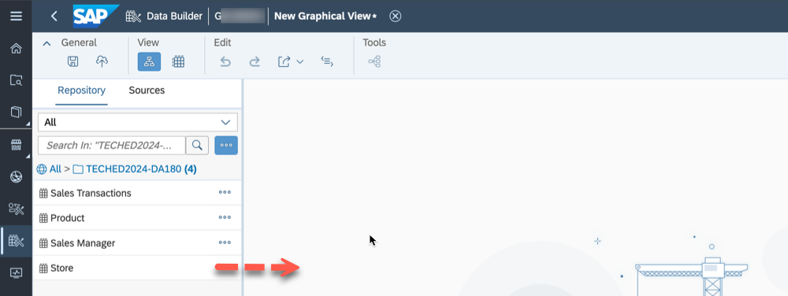
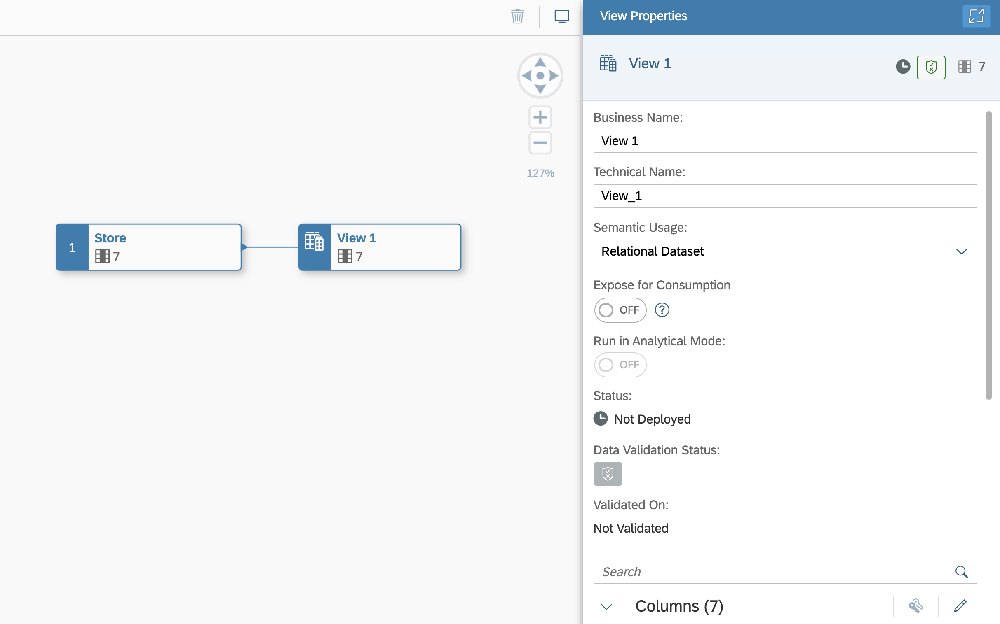
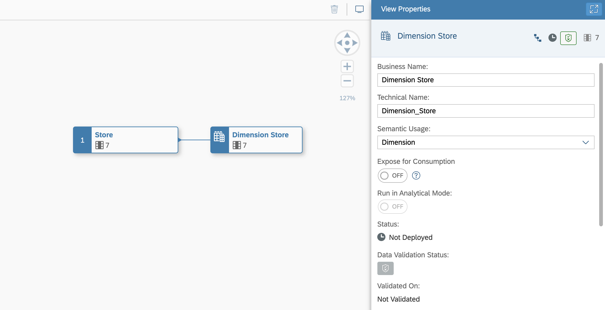
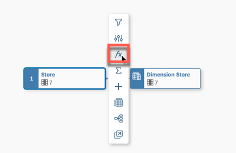
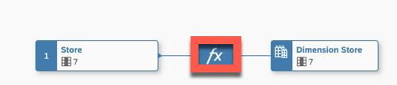
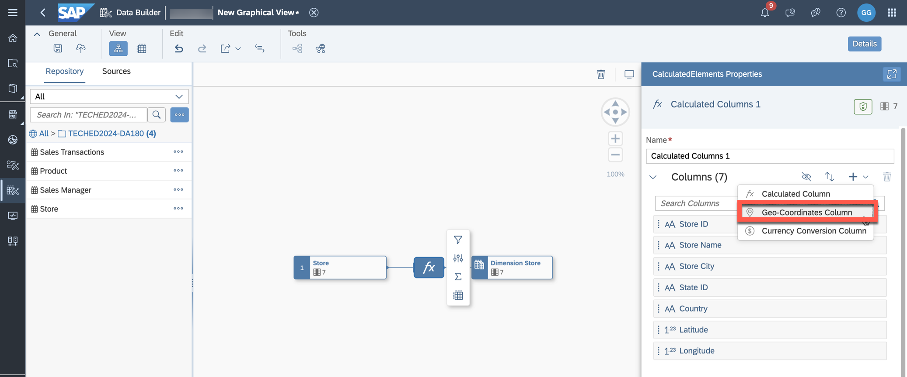
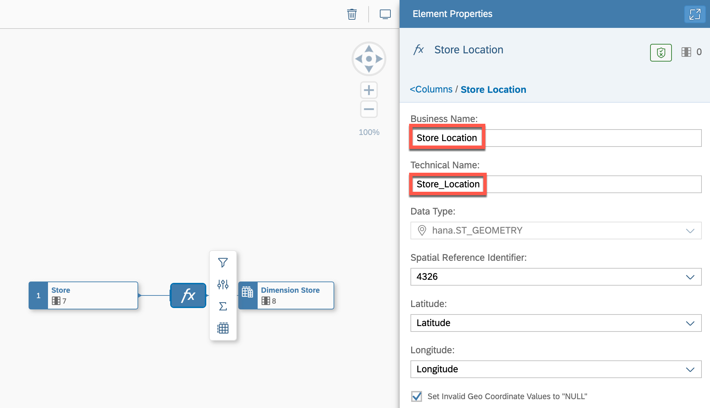
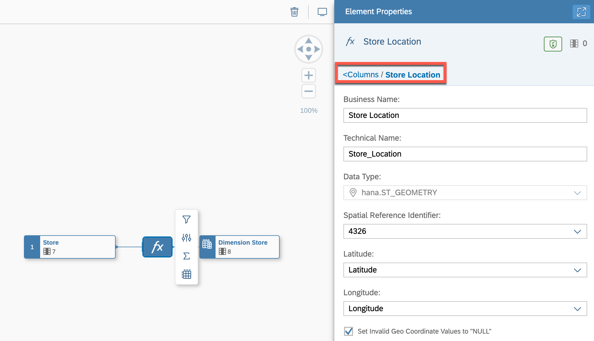
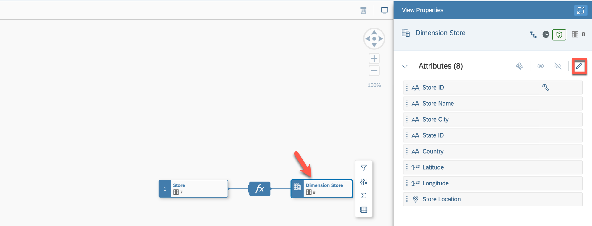
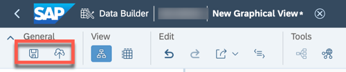

# Exercise 6 - Creating the Dimension 

In this exercise, we will create a new view of the semantic type dimension based on our previously created table. We will enhance this data by configuring a geographic enrichment so that we can visualize the store location on a geo map later in SAP Analytics Cloud.

1. Log On to your SAP Datasphere tenant.
2. Select the menu option Data Builder on the left-hand side.

3. Click ***New Graphical View***.
  

4. On the left-hand side you can decide between: <ul><li>Repository: Here you have access to the local tables (imported data), Views, Intelligent Lookups and Shared Objects.</li><li>Sources: Here you have access to respective objects from your connections.
 

5. Ensure you select the option ***Repository*** and open the folder "TECHED2024-DA180".

6. You are presented with the list of tables, which we created previously. Drag and drop the table ***Store*** to the canvas.
  

7. You automatically will – in addition to the table you dragged to the canvas – receive the output view, in the screenshot called ***View 1***:
8. Navigate to the ***View Properties*** window by clicking on the View 1 in the canvas.
  

9. Here you can configure properties for the view: <ul><li> Business Name: Dimension Store</li><li> Technical Name: Dimension_Store</li><li> Semantic Usage: Dimension</li>
    
 
 
10. Now click on the table ***Store*** on the canvas.
  

11. When you select the table on the canvas, you have the following options (top to bottom) <ul><li> You can add filter on top of the source entity.</li><li> You can rename or hide columns as part of a projection.</li><li> You can add Calculated Columns.</li><li> You can add an Aggregation View.</li><li> You can add additional tables / views based on suggested joins, which are based on your Entity
Relationship model.</li><li>You can preview the data.</li><li>You can open the Impact & Lineage Analysis </li><li> You can open the table in the editor in another browser tab.
 

12. Use the option to add a new calculated column. This option also includes the ability to configure the geographic enrichment.
  
 
13. Now click on the new node ***fx*** on the canvas.
  

14. Navigate to the properties on the right-hand side.

15. Click on the ***+*** sign and select the option ***Geo-Coordinates Column***.
  
 
16. You are presented with the properties for the new column. Configure the following details: <ul><li> Business Name: Store Location</li><li> Technical Name: Store_Location</li><li> Latitude: Latitude</li><li> Longitude: Longitude
  
 

17. After you configured the details, click on the ***<Columns*** option in the properties window to go back.
  

18. Select the final output node for the graphical view of semantic type dimension.
19. Navigate to the properties on the right-hand side.

20. Navigate to the ***Attributes*** area. 
21. Use the pencil icon (top right area) to open the details for the Attributes.
 

22. Ensure that the semantic type for the attribute ***Store Name*** is set to ***Text***.
23. Set the ***Text/Association*** column for the line item ***Store ID*** to ***Store Name***.
  

24. Click ***Close***.

 
25. In the toolbar in the ***General*** menu, use the option to save your view in the folder TECHED2024-DA180.
26. After saving your dimension view, ensure you deploy the view.
  

## Summary

You've now created your dimension view ***Dimension Store*** including the added geo-coordinates column ***Store location***, which is required to use visualizations on geo maps within SAP Analytics Cloud.

Continue to - [Exercise 07: Creating the View ](../ex07/README.md)

