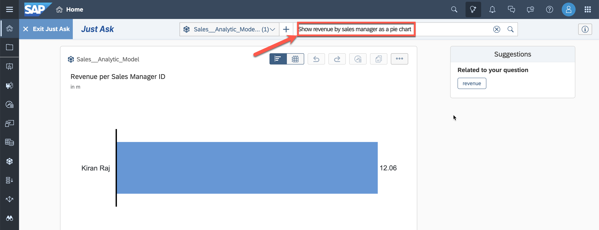
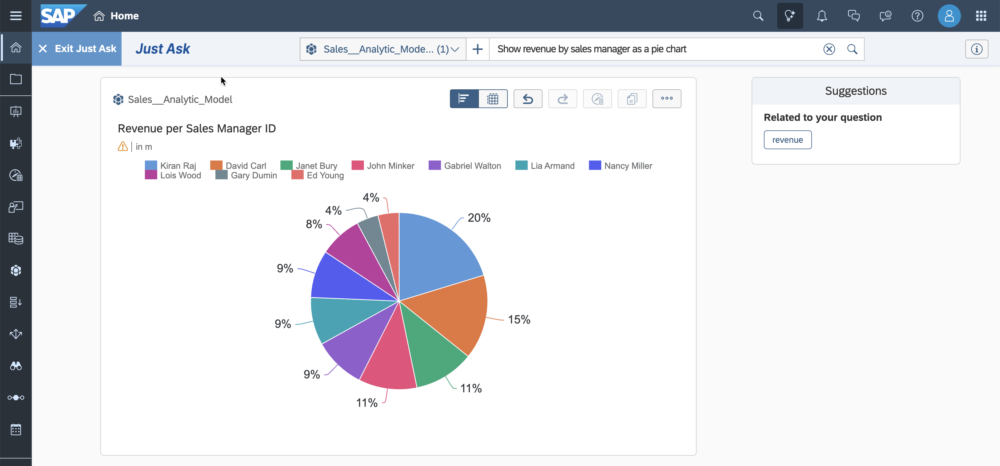
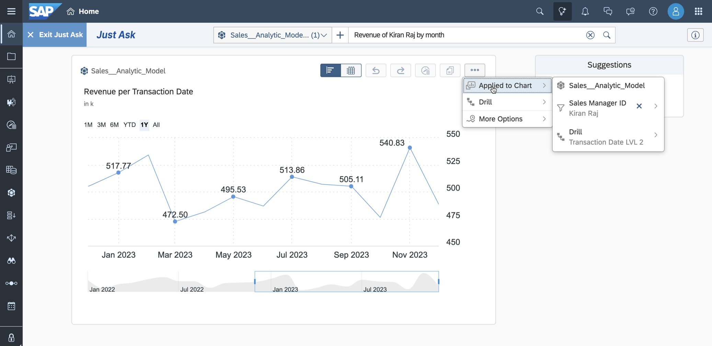
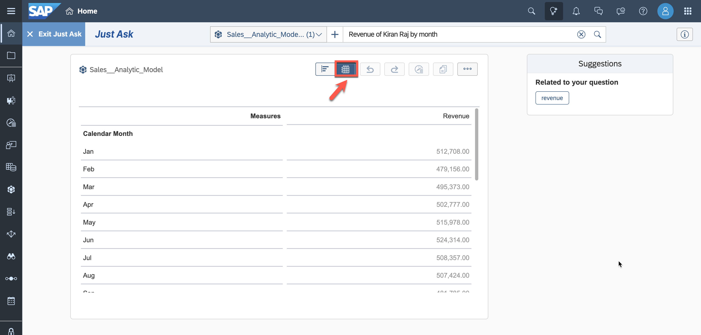

# Exercise 20 - Identify Top-Performing Sales Managers with Just Ask

>:memo: **Note:** This is an OPTIONAL exercise.

---

## :beginner: Detour: SAP Analytic Cloud - Just Ask

Just Ask is the natural language query feature powered by artificial intelligence in SAP Analytics Cloud. It offers an easy and efficient way to ask questions about your data and provides fact-based answers in the form of tables and charts.

## End of Detour

## Start of Exercise

In this exercise, we will utilize Just Ask to query our data model by asking questions in everyday English. Our goal is to identify the best sales managers in our company.

1. Access the SAP Analytics Cloud tenant you got access to as part of the basic trial.

    

---

>:bulb: **Note:** The system may ask you to sign in again. Use the same user name and password for SAC as for Datasphere.

---

2. Select the menu ***Just Ask*** in the header.

     

3. Close the welcome guide, if opens.

     

4. Click the model icon left to the search bar and select "Add Model to Search".

     

5. Select ***DSP*** as the connection on the left panel, choose your space, and click on the previously created Analytic Model ***Sales__Analytic_Model***.

    

6. The **Successfully Added** message will appear with the information that this model will only be available during the current sessions. Click ***OK***.

7. Now enter your question into the search bar: ***Who is the best sales manager based on revenue?*** 

    To run the search, press enter or click on the magnifying glass symbol.

    

8. The search result is displayed as a card under the search field.  

    `Kiran Raj` is identified as the sales manager generating the most revenue. You can review the automatically applied settings, such as sorting and ranking, in addition to the correctly identified attribute and measure.

    

9. Compare him with the other sales managers. This time, the result should be displayed as a pie chart. Enter the following in the search bar on the top and search: ***Show revenue by sales manager as a pie chart*** .

    

10. The pie chart below is displayed. Kiran Raj is responsible for 20% of the generated revenue. 

    

11. Can we see peaks for the revenue generated by Kiran Raj? Enter ***Revenue of Kiran Raj by month*** and search.

12. The chart visualizes the change of generated revenue. A filter is defined for sales manager and the drill level for the transaction date was adjusted to display months.

    

13. If you prefer to view the query result in a table format, you can change the display mode to a table.

    

## Summary

Just Ask simplified and accelerated the process of finding answers to your reporting questions. Using the data model exposed by SAP Datasphere, you were able to obtain answers quickly without requiring any preconfigured data report.

You can continue with one of the _optional_ exercises:
- [Exercise 21: Create Row-Level Permissions based on External Hierarchy](../ex21/README.md)
- [Exercise 22: Explore the Analytic Model](../ex22/README.md)
- [Exercise 23: Create a Transformation Flow](../ex23/README.md)