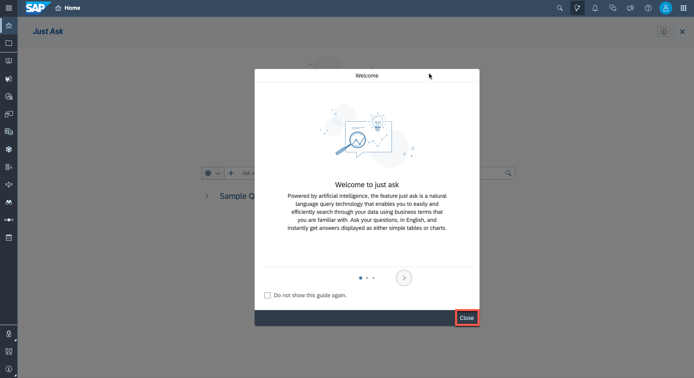
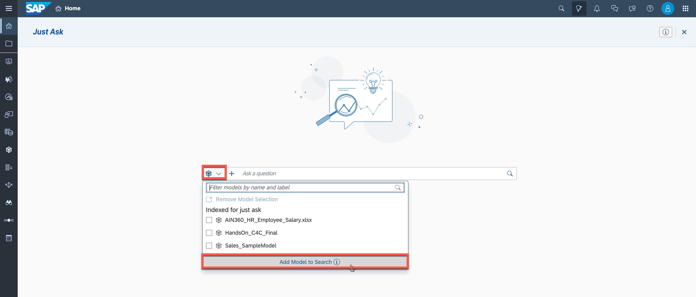
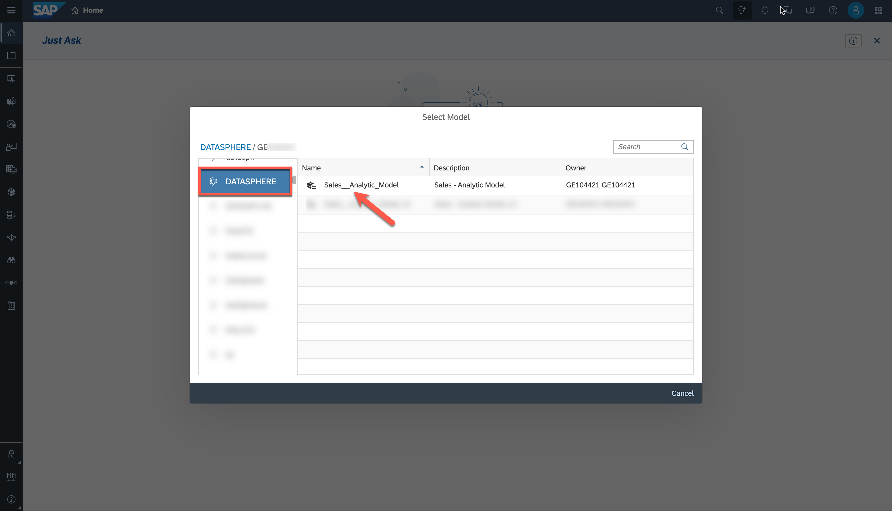
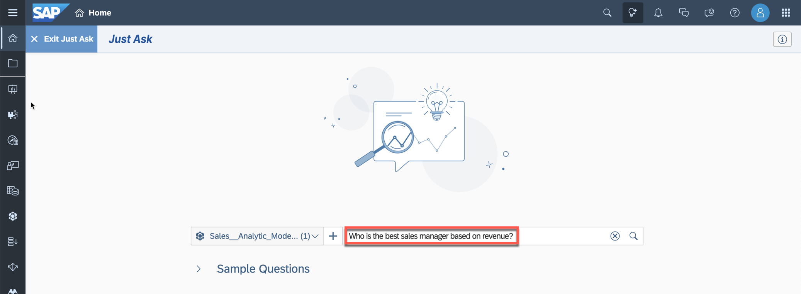
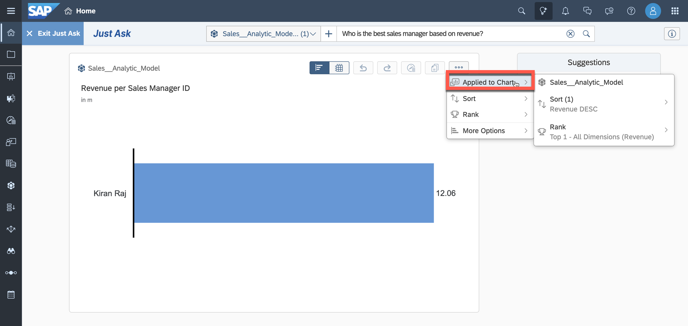
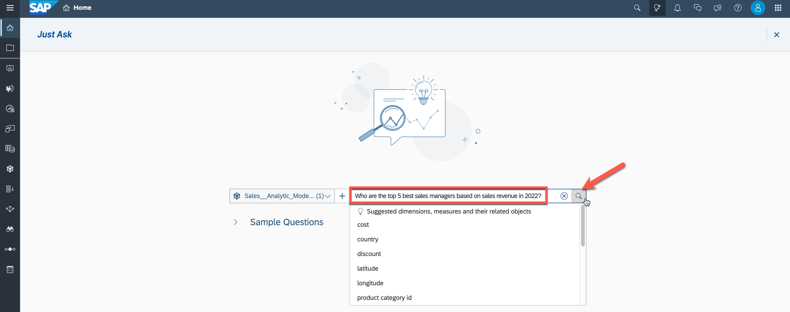
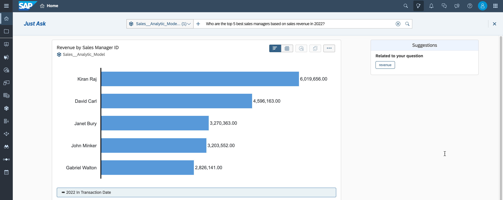

# Exercise 20 - Identify Top-Performing Sales Managers with Just Ask

>:memo: **Note:** This is an OPTIONAL exercise.

---

## SAP Analytic Cloud - Just Ask

Just Ask is the natural language query feature powered by artificial intelligence in SAP Analytics Cloud. It provides an easy and efficient way to ask questions on data and provides fact-based answers in tables and charts.

## Start of Exercise

In this exercise, we will utilize Just Ask to query our data model by asking questions in everyday English. We want to identify the best sales managers of our company.

1. Access the SAP Analytics Cloud tenant you got access to as part of the basic trial.
  
 

---

>:bulb: **Tip:** The system will ask you to resign in.

---

2. Select the menu ***Just Ask*** in the header.
  

3. Close the welcome guide.
  

4. Click the model icon left to the search bar and select "Add Model to Search".
  

5. Select "DATASPHERE" as the connection on the left panel, select your space and click on the before created Analytic Model "Sales_Analytic_Model".
 

6. The **Successfully Added** message will appear with the information that this model will only be available during the current sessions. Click "OK".

7. Now enter your question into the search bar: ***Who is the best sales manager based on revenue?*** To run the search, press enter or click on the magnifying glass symbol.
 

8. Kiran Raj is identified as the sales manager generating the most revenue. You can check which settings have been automatically set based on your question (sorting and ranking in addition to the correct identified attribute and measure).
 

9. ***Show revenue by sales manager as a pie chart*** 

10. 

SAC Just Ask: Sales Revenue compared to XY (Variance), Top 5, show me sales revenue for all managers, pie chart, top5, in 2022, …

7. Now enter your question into the search bar. As we are interested in the top-performing sales managers, enter "Who are the top 5 best sales managers based on sales revenue in 2022?" and run the search.
 

8. The search results is displayed as card under the search field. It contains the search query used to generate the result (Revenue by Sales Manager ID), the underlaying source model and the requested data displayed by default as a chart (can be switched to table).
 

## Summary

You have used Just Ask with an Analytic Model of SAP Datasphere.

You can continue with one of the optional exercises:
- [Exercise 21: Create Row-Level Permissions based on External Hierarchy)](../ex21/README.md)
- [Exercise 22: Explore the Analytic Model](../ex22/README.md)
- [Exercise 23: Create a Transformation Flow)](../ex23/README.md)

