# Exercise 21 - Create Row-Level Permissions based on External Hierarchy

>:memo: **Note:** This is an OPTIONAL exercise.

---

## :beginner: Detour: SAP Datasphere - Hierarchies

You can specify the following types of hierarchy:

Parent-Child - the hierarchy is recursive, may have any number of levels, and is defined by specifying a parent column and a child column within the dimension. For example, a departmental hierarchy could be modeled with the Parent Department ID and Department ID columns.

Level-Based - the hierarchy is non-recursive, has a fixed number of levels, and is defined by specifying two or more level columns within the dimension. For example, a time hierarchy could be modeled with the: Year, Quarter, Month, Week, and Day columns.

External Hierarchy - the parent-child hierarchy information is contained in a separate entity, which needs to be associated with the dimension (see Create an External Hierarchy for Drill-Down).

Data access controls can be defined using criteria as hierarchy values. Each user can only see the records that match the hierarchy values she is authorized for in the permissions entity, along with any of their descendents. Only external hierarchies with a single pair of parent-child columns are supported. 

## End of Detour

## Create a Parent-Child Hierarchy

1. Log On to your SAP Datasphere tenant.
2. Select the menu option Data Builder on the left-hand side
3. Select the option ***New Table***.

4. Enter the following details: <ul><li>Business Name - Hierarchy_ProductCategory</li><li>Technical Name - Hierarchy_ProductCategory</li><li>Semantic Usage - Hierarchy 
   

5. Warnings are displayed as no parent and child columns are defined yet which represent the hierarchy. The child column must be a key column and the parent and child columns must have the same data type.

6. Enter the following attributes for the table:
 
| Key: | Business Name:        | Technical Name:                       | Data Type:          | Semantic Type       | Text/Association          |
|:-----|:----------------------|:--------------------------------------|:--------------------|:--------------------|:----------------------|
| X    | Child Category         | Child_Category                       | String (30)         |                |                       |
|      | Parent Category       | Parent_Category                       | String (30)          | None                |          |

5. Ensure that ***Child Category*** is set as key.
    
  
6. Now select the column ***Parent Category*** as parent and the column ***Child Category*** as child. Notice that the validation icon in the upper right corner turns green. 
 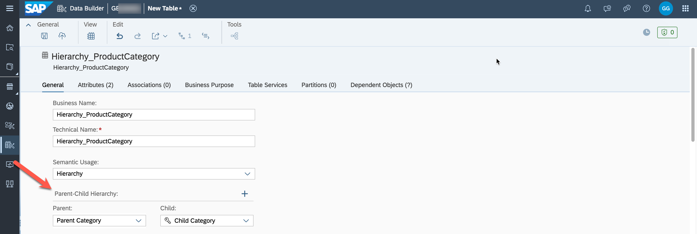 

7. Save and deploy your hierarchy table. 

8. Open the data editor to insert records.
 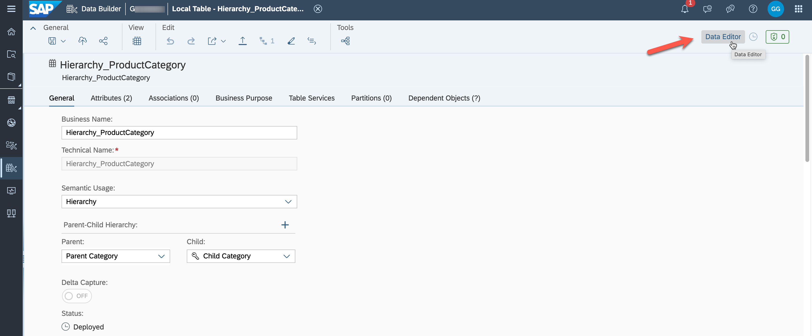 

9. Add the following six entries to the table:

| Child                 	| Parent        	| 
|:-----------------------	|:---------------	|
|          Alcohol      	| Beverages     	| 
| Non-Alcoholic         	| Beverages     	|    
|     Carbonated Drinks 	| Non-Alcoholic 	|     
|     Energy Drinks     	| Non-Alcoholic 	|     
|     Juices            	| Non-Alcoholic 	|   
|     Others            	| Beverages     	|  

10. Confirm the data entries and save.
 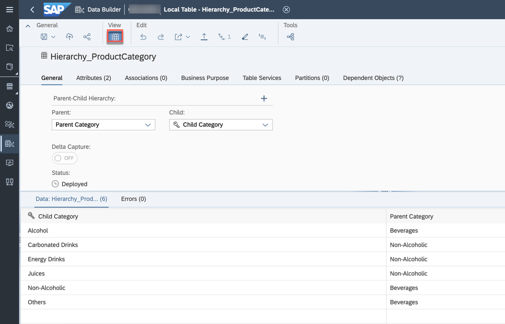 

## Create a Permission Entity
A permission entity (view or table) lists SAP Datasphere user IDs (in the form required by your identity provider) and assigns them to one or more criteria. 

1. Select the option ***New Table*** in the Data Builder.

2. Enter the following details: <ul><li>Business Name - Permission Entity Product Category </li><li>Technical Name - PE_ProductCategory</li><li>Semantic Usage - Relational Dataset 
   

3. Enter the following attributes:
 
| Key: | Business Name:        | Technical Name:                       | Data Type:          | Text/Association          |
|:-----|:----------------------|:--------------------------------------|:--------------------|:----------------------|
| X    | Record ID         | Record_ID                     | Integer         |                | 
|      | User ID         | User_ID                       | String (30)         |                |      
|      | Product Category      | Parent_Category                       | String (30)          |                 |      

4. Verify your configuration.
 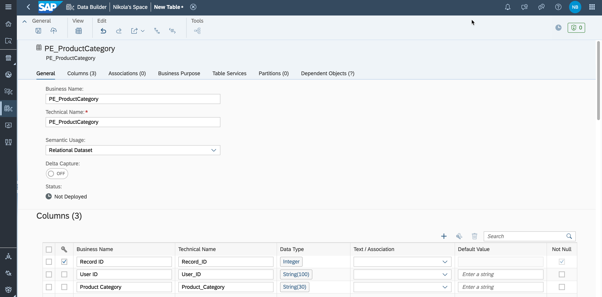 

5. Save and deploy the table.

6. After the table is deployed, open the data editor to add records.

7. Add the following record to the table:

| Record ID                 	| User ID        	| Product Category        | 
|-----------------------	|---------------	| ---------------	|
|          1      	| USER ID     	|  Non-Alcoholic     	| 

8. Save the added record.
 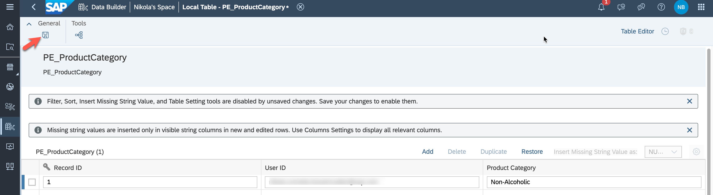 

## Create a Data Access Control Entity

We want to protect the data of our sales transactions based on this parent-child hierarchy. Reporting users should only see sales of the product categories they have permissions to. We define the permissions based on the nodes "Alcohol", "Non-Alcoholic" and "Others".

1. In the side navigation area, select ***Data Builder*** and click ***New Data Access Control*** to open the editor.
 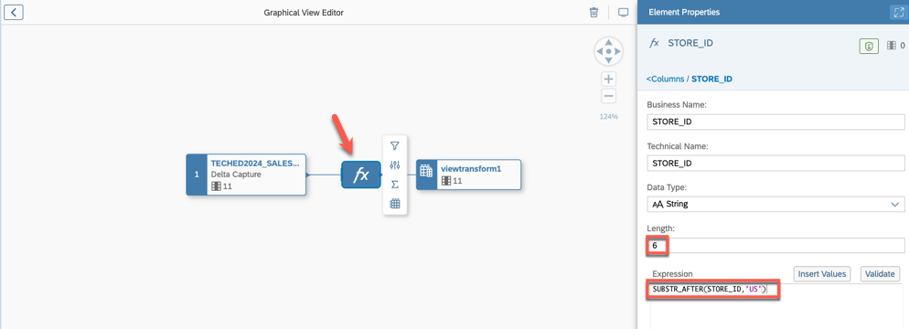 

2. Enter the following details in the ***General*** section and select the permission entity which you created in the previous step: <ul><li>Business Name - DAC Product Category</li><li>Technical Name - DAC_ProductCategory</li><li>Structure - Hierarchy</li><li>Permission Entity - PE_ProductCategory<li>Identifier Column - User ID 
 

3. Enter the following details in the ***Criteria*** section and select the hierarchy table which you created in the first step of this exercise: <ul><li>Business Name - Product Category</li><li>Technical Name - Product_Category</li><li>Hierarchy Entity - Hierarchy_ProductCategory</li><li>Criterion Column - Product Category 
 

4. Verify that your settings look like in the screenshot below:
 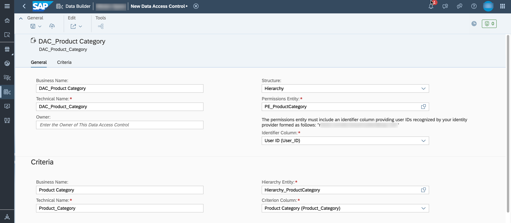

5. Save and deploy your new Data Access Control entity.

## Apply the Data Access Control Entity to a View
1. Open your previously created view ***Sales_View***.

2. The attributes which are authorization-relevant need to be part of the fact view. Drag the table ***Product*** into the editor (join).

3. Set the Join Type to ***Left*** and the cardinality to Many (***Sales Transactions***) to Exactly One (***Product***). Map the columns ***Product ID***.
 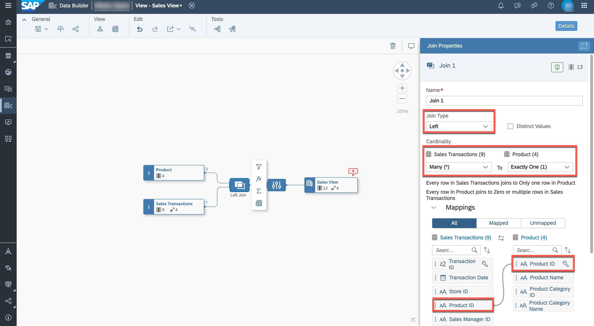

4. In the model properties, add a new Data Access Control.
 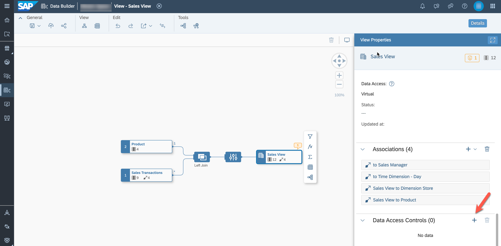

5. Select the previously created DAC ***DAC_ProductCategory***.
 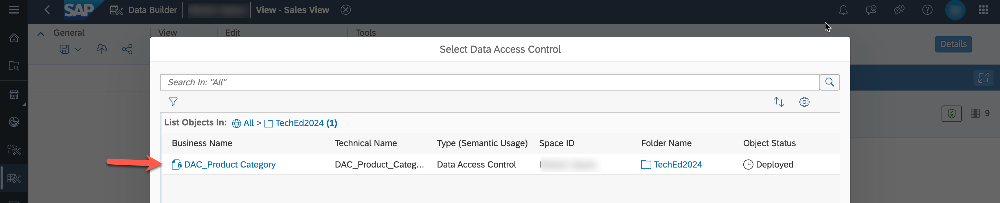

6. Map the two columns named ***Product Category Name***.
 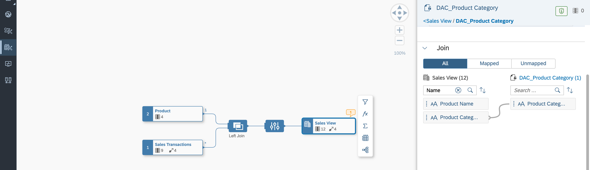

7. Save and deploy the view ***Sales_View***.

8. Open the data preview and validate that you can only see sales for products of the category Non-Alcoholic.

## Summary

You've now protected the transactional records of the fact view with a Data Access Control based on product categories. If you would like to recreate authorizations from the source system, you can import analysis authorizations from SAP BW and SAP BW/4HANA.

You can continue with one of the optional exercises:
- [Exercise 20: Identify Top-Performing Sales Managers with Just Ask](../ex20/README.md)
- [Exercise 22: Explore the Analytic Model](../ex22/README.md)
- [Exercise 23: Create a Transformation Flow)](../ex23/README.md)
