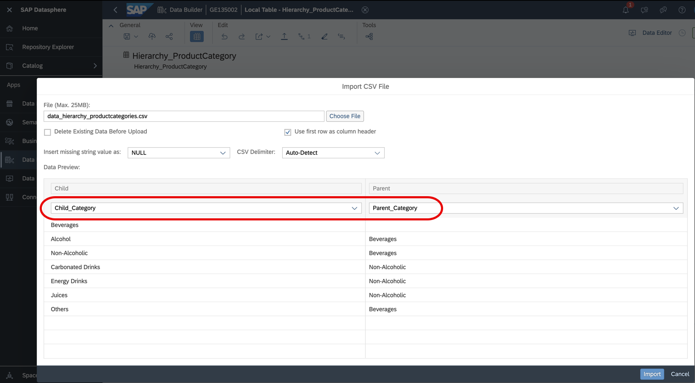
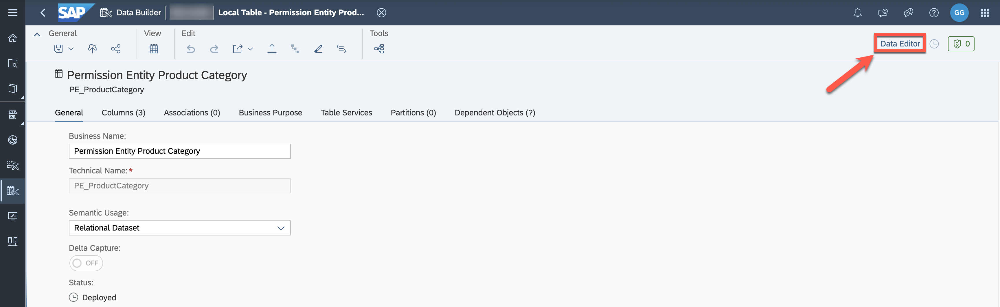
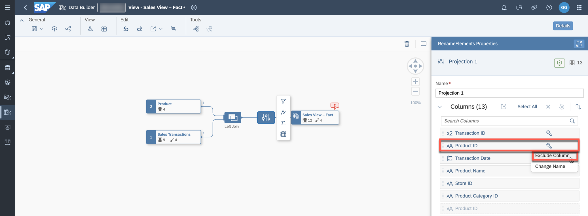
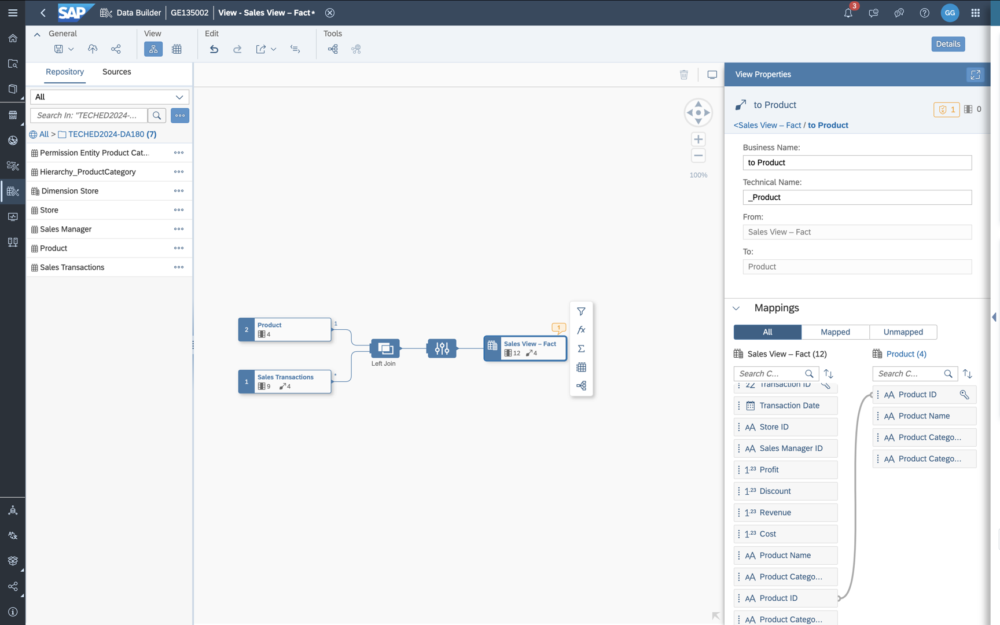
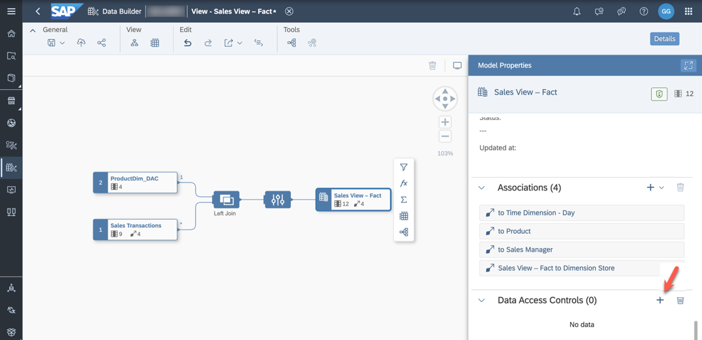
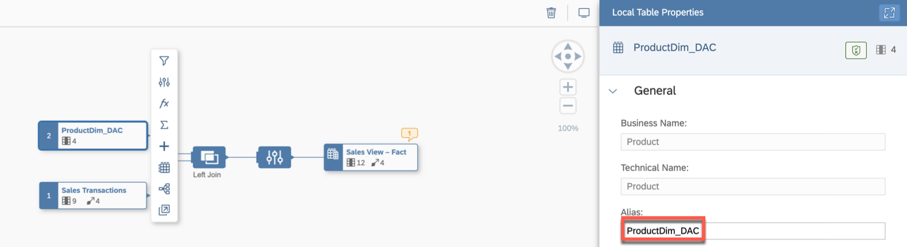
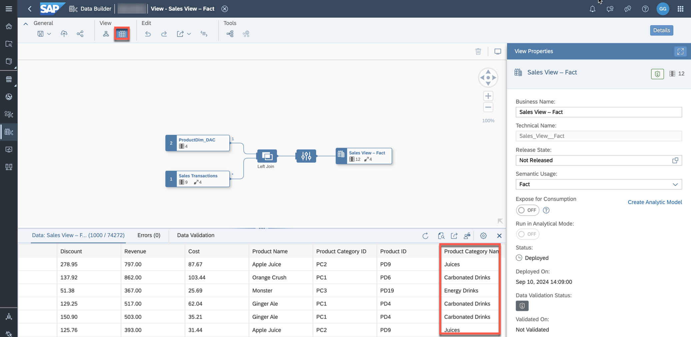
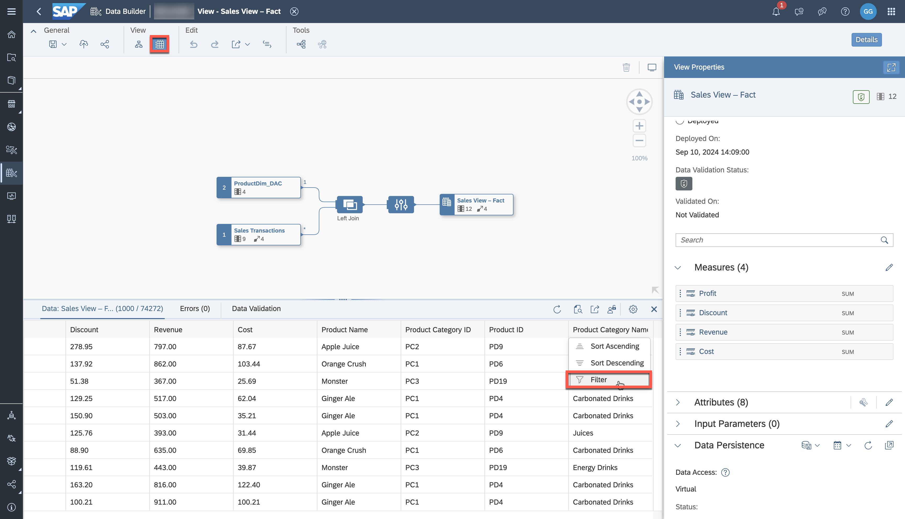
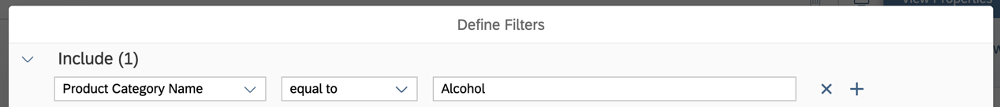

# Exercise 21 - Create Row-Level Permissions based on an External Hierarchy

>:memo: **Note:** This is an OPTIONAL exercise.

---

## :beginner: Detour: SAP Datasphere - Hierarchies and Data Access Controls

You can specify the following [types of hierarchies](https://help.sap.com/docs/SAP_DATASPHERE/c8a54ee704e94e15926551293243fd1d/218b7e6bd60846dda2f03b789b389cb0.html?locale=en-US):

1. **Parent-Child** - the hierarchy is recursive, may have any number of levels, and is defined by specifying a parent column and a child column within the dimension. For example, a departmental hierarchy could be modeled with the Parent Department ID and Department ID columns.

2. **Level-Based** - the hierarchy is non-recursive, has a fixed number of levels, and is defined by specifying two or more level columns within the dimension. For example, a time hierarchy could be modeled with the: Year, Quarter, Month, Week, and Day columns.

3. **[External Hierarchy](https://help.sap.com/docs/SAP_DATASPHERE/c8a54ee704e94e15926551293243fd1d/dbac7a862b3744d8a71d268644aac389.html?locale=en-US)** - the parent-child hierarchy information is contained in a separate entity, which needs to be associated with the dimension (see Create an External Hierarchy for Drill-Down).

4. **[Hierarchy with Directory](https://help.sap.com/docs/SAP_DATASPHERE/c8a54ee704e94e15926551293243fd1d/dbac7a862b3744d8a71d268644aac389.html?locale=en-US)** - your entity contains one or more parent-child hierarchies and has an association to a directory dimension containing a list of the hierarchies. These types of hierarchy entities can include nodes from multiple dimensions (for example, country, cost center group, and cost center) and are commonly imported from SAP S/4HANA Cloud and SAP BW (including SAP BW Bridge) systems.

**[Data access controls](https://help.sap.com/docs/SAP_DATASPHERE/be5967d099974c69b77f4549425ca4c0/a032e51c730147c7a1fcac125b4cfe14.html?locale=en-US)** allow you to apply row-level security to your objects. There are different options for specifying criteria to determine which user is allowed to access specific data. One option is to define access based on a hierarchy. Each user can only view records that match the hierarchy values they are authorized for in the permissions entity, along with any of their descendants. Only external hierarchies with a single pair of parent-child columns are supported.  

## End of Detour

## Create a Parent-Child Hierarchy

1. Log On to your SAP Datasphere tenant.

2. Select the menu option ***Data Builder*** on the left-hand side.

3. Select the option ***New Table***.

4. Enter the following details:

    - ***Business Name***: Hierarchy_ProductCategory
    - ***Technical Name***: Hierarchy_ProductCategory
    - ***Semantic Usage***: Hierarchy

5. Warnings are displayed because no parent and child columns are defined yet to represent the hierarchy. The child column must be a key column, and both the parent and child columns must have the same data type.

6. Enter the following ***Attributes*** for the table:
 
| Key: | Business Name:        | Technical Name:                       | Data Type:          |
|:-----|:----------------------|:--------------------------------------|:--------------------|
| X    | Child Category        | Child_Category                        | String (30)         | 
|      | Parent Category       | Parent_Category                       | String (30)         | 

7. Ensure that ***Child Category*** is set as key.

       
  
8. Now select the column ***Parent Category*** as the parent and the column ***Child Category*** as the child. Notice that the validation icon in the upper-right corner turns green.

     

9. Save and deploy your hierarchy table in the folder `TECHED2024-DA180`. 

10. Download the :file_folder: CSV file [`data_hierarchy_productcategories.csv`](data/data_hierarchy_productcategories.csv) and upload the data to the table.

     

    Make sure to map the columns from the CSV file to the corresponding columns in the table.

    

11. Verify the data in the data preview.

     

## Create a Permission Entity

A permission entity (view or table) lists SAP Datasphere user IDs (in the form required by your identity provider) and assigns them to one or more criteria. In this example, you will define criteria for your own user so that you only see products belonging to the category or subcategories of non-alcoholic beverages.

1. Select the option ***New Table*** in the Data Builder.

2. Enter the following details:

    - ***Business Name***: Permission Entity Product Category
    - ***Technical Name***: PE_ProductCategory
    - ***Semantic Usage***: Relational Dataset

3. Enter the following columns:
 
    | Key: | Business Name:   | Technical Name:  | Data Type: | Text/Association |
    |:-----|:-----------------|:-----------------|:-----------|:-----------------|
    | X    | Record ID        | Record_ID        | Integer    |                  |
    |      | User ID          | User_ID          | String (50)|                  |
    |      | Product Category | Product_Category | String (30)|                  |

4. Verify your configuration.

     

5. Save and deploy the table in the folder `TECHED2024-DA180`.

6. After the table is deployed, open the data editor to add records.

     

7. Add the following record to the table. Replace the first part of the email address below for the user ID with the name of your user (same as the space name). Alternatively, you can copy your email address by going to ***Profile*** in the upper-right corner and selecting ***Settings***, then ***User Account***.

     

| Record ID | User ID                           | Product Category |
|-----------|-----------------------------------|------------------|
| 1         | geXXXXXX@sapexperienceacademy.com | Non-Alcoholic    |

8. Save the added record.

## Create a Data Access Control Entity

We want to protect the data of our sales transactions based on this parent-child hierarchy. Reporting users should only see sales for the product categories they have permissions to. Permissions will be defined for the nodes ***Alcohol***, ***Non-Alcoholic***, and ***Others***.

1. In the side navigation area, select ***Data Builder*** and click ***New Data Access Control*** to open the editor.

2. Enter the following details in the ***General*** section and select the permission entity which you created in the previous step:
    - ***Business Name***: DAC Product Category
    - ***Technical Name***: DAC_ProductCategory
    - ***Structure***: Hierarchy
    - ***Permission Entity***: PE_ProductCategory
    - ***Identifier Column***: User ID

3. Enter the following details in the ***Criteria*** section and select the hierarchy table which you created in the first step of this exercise:
    - ***Business Name***: Product Category
    - ***Technical Name***: Product_Category
    - ***Hierarchy Entity***: Hierarchy_ProductCategory
    - ***Criterion Column***: Product Category

4. Verify that your settings look like in the screenshot below:

    

5. Save and deploy your new Data Access Control entity in the folder `TECHED2024-DA180`.

## Apply the Data Access Control Entity to a View
1. Open your previously created view ***Sales View – Fact*** (***`Sales_View__Fact`***).

2. The attributes which are authorization-relevant need to be part of the fact view. Drag the table ***Product*** into the editor over the ***Sales Transactions** node. The join should be created autoamtically.

3. Set the Join Type to ***Left*** and the cardinality to Many (***Sales Transactions***) to Exactly One (***Product***). Map the columns ***Product ID***.

    

4. Open the Projection Node. The column ***Product ID*** of the table ***Sales Transactions*** is hidden while the column derived from the table ***Product*** (dimension) is visible. 

    We do not want to keep ***Product ID*** as a key, therefore exclude the column ***Product ID*** (Key from ***Products***) and restore ***Product ID*** (***Sales Transactions***).

    

    >:bulb: If you select the column in any diagram node you can trace the lineage back to the source.

5. Open the node ***Sales View – Fact***. Go to the association which points to the dimension ***Product*** and redo the mapping (***Product ID*** to ***Product ID***) as this got lost because of the join introduced above.

    

6. In the model properties, add a new Data Access Control.

    

7. Select the previously created DAC ***DAC_ProductCategory*** (single click).

    

8. Map the two columns named ***Product Category Name*** (enter "`Name`" in the ***Search*** field). When you move your cursor over the columns, the complete name is displayed as tooltip.

    

9. Set the Alias of the node ***Product*** to ***ProductDim_DAC***.

    

10. Save and deploy the view ***Sales_View - Fact***. If you see the validation message warning that an association has been changed, click ***Deploy Anyway***.

11. Open the data preview for the node ***Sales View – Fact*** and validate that you can only see sales for non-alcoholic data products.

    

12. Add a filter for ***Product Category Name***.
    

13. Filter on records which contain values equal to ***Alcohol***. This search should not display any value.
    

    > :boom: **Important:** :boom:    
    Please note that you will now only see a limited number of records due to the assigned data access control. You can modify the data record in the permission table ***PE_ProductCategory*** and replace the value in the column ***Product Category*** (Non-Alcoholic) with ***Beverages*** to see all records again when working through other exercises.

14. You can open the previously created reports in SAP Analytics Cloud. You will only see the records that your user is authorized to access.

## Summary

You've now protected the transactional records of the fact view with a Data Access Control based on product categories. If you want to recreate authorizations from the source system, you can import analysis authorizations from SAP BW and SAP BW/4HANA.

You can continue with one of the optional exercises:
- [Exercise 20: Identify Top-Performing Sales Managers with Just Ask](../ex20/README.md)
- [Exercise 22: Explore the Analytic Model](../ex22/README.md)
- [Exercise 23: Create a Transformation Flow](../ex23/README.md)
