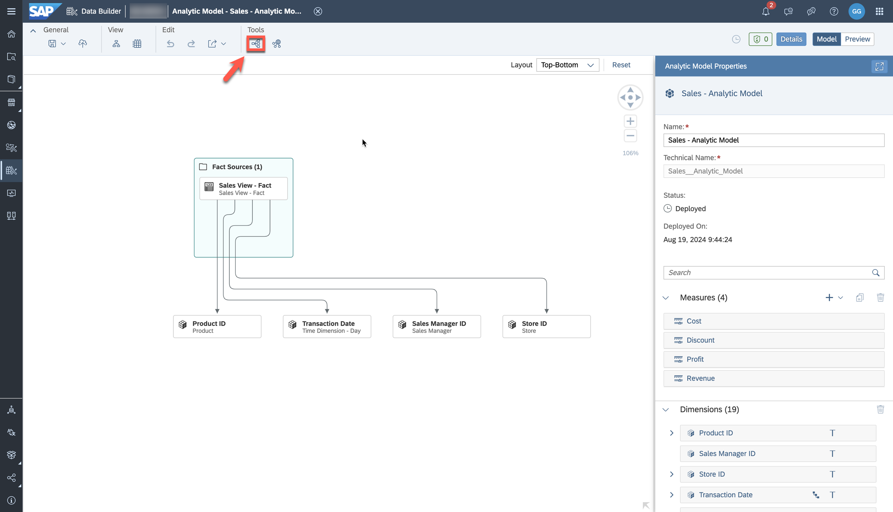
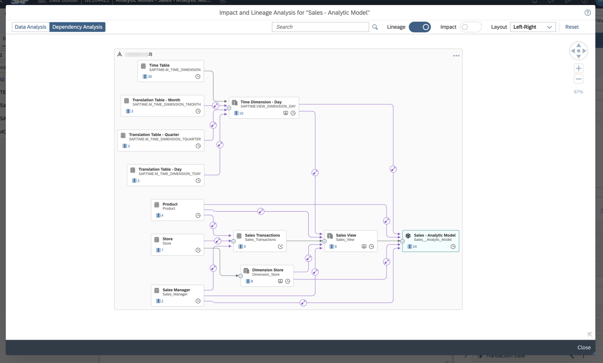
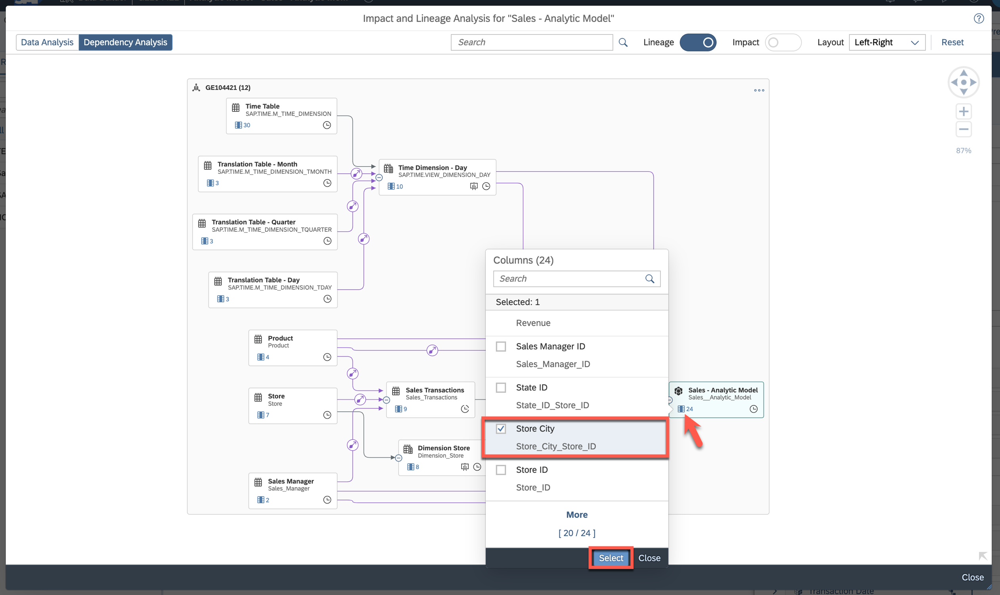
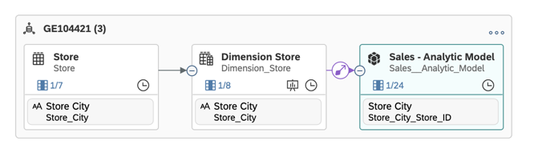
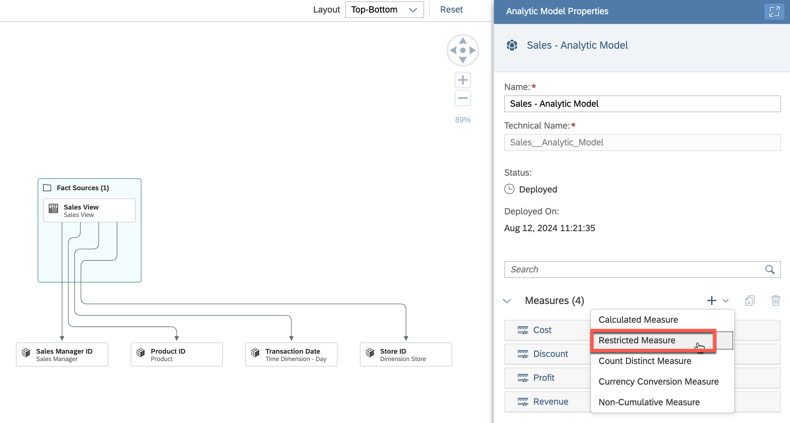
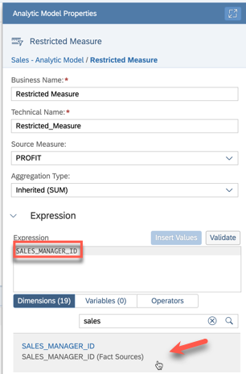
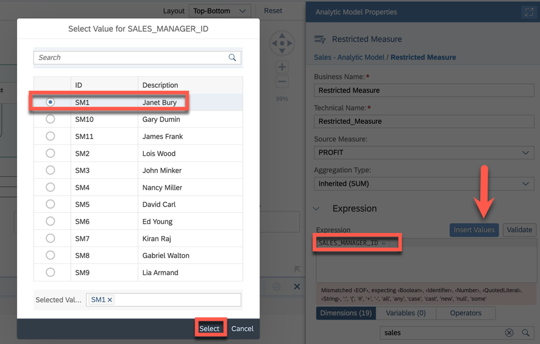
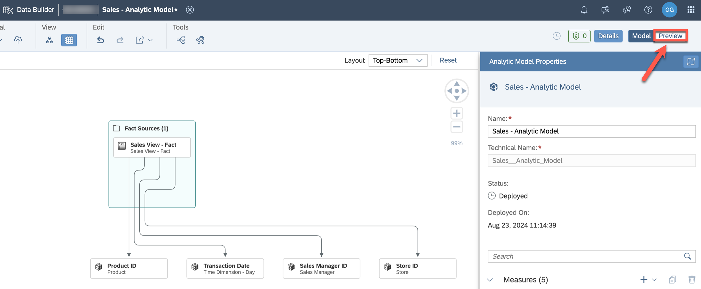
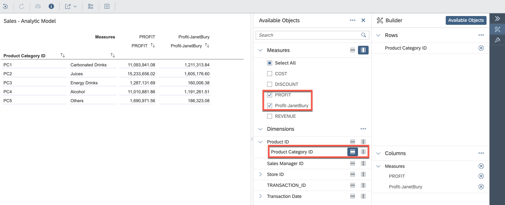

# Exercise 22 - Explore the Analytic Model

>:memo: **Note:** This is an OPTIONAL exercise.

---

## :beginner: Detour: SAP Datasphere - Analytic Model

Analytic models are the analytical foundation for making data ready for consumption in SAP Analytics Cloud. They allow you to create and define multi-dimensional models to provide data for analytical purposes to answer different business questions. Pre-defined measures, hierarchies, filters, parameters, and associations provide flexible and simple navigation through the underlying data.

In this exercise, you will learn how to use the data preview of the Analytic Model and how to create different types of new measures enhancing the existing model.

## End of Detour

## Start of the exercise

1. Log On to your SAP Datasphere tenant.
2. Select the menu option Data Builder on the left-hand side.
3. Open the previously created Analytic Model ***Sales - Analytic Model***.
4. To get an overview about the data model as a reminder, open the ***Impact and Lineage Analysis***.
   

5. The ***Data Analysis*** diagram helps to understand the lineage of the Analytic Model. This view focuses on data movements and transformations. You see the flow from the local table containing sales transactions, the view and the Analytic Model. 
   

6. Switch to the ***Dependency Analysis*** diagram to display objects which are connected through associations (and data access controls if defined). You can see the lineage of the associations like the time dimension.
  

7. In addition to the lineage and impact of objects, you can analyze columns of tables, graphical and SQL views and Analytic Models. Click the columns icon on the Analytic Model to open the list of columns, select ***Store City*** and click ***Select***.
  

8. The diagram refreshes to show the lineage of the selected column under the analyzed object.
  

9. Select ***Close*** to return to the Analytic Model editor. 

10. Create a new ***Restricted Measure***. Restricted measures build on existing measures but apply flexible filter expressions. They can filter statically (done in this exercise) but they could also refer to dimension attributes or variables.
  

11. We define a restricted measure to analyze the profit generated by the sales managers, in particular now for Janet Bury.
  

12. In the ***Expression*** editor, add ***=*** after ***SALES_MANAGER_ID***. Click ***Insert Values*** and select Janet Bury (ID 'SM1').
  

13. Change the Business Name and the Technical Name to ***Profit-JanetBury***.

14. Open the ***Preview*** in the upper right corner. It is an analytical preview, you can navigate through the various dimensions and view the aggregated data. You see how the data will look like in an SAP Analytics Cloud story.
  

15. Open the builder on the right side and select the measures ***Profit*** and ***Profit-JanetBury*** as well as ***Product Category ID*** in the ***Dimensions*** section. The two measures allow the comparison of the profit generated by Janet to the overall profit.
  

16. Return to the Analytic Model editor by selecting ***Model*** in the upper right corner.

17. Save and deploy the model.

## Summary

You have now explored more of the various features of the Analytic Model. 

You can continue with one of the optional exercises:
- [Exercise 20: Identify Top-Performing Sales Managers with Just Ask](../ex20/README.md)
- [Exercise 21: Create Row-Level Permissions based on External Hierarchy](../ex21/README.md)
- [Exercise 23: Create a Transformation Flow](../ex23/README.md)
