# Exercise 23 - Create a Transformation Flow

>:memo: **Note:** This is an OPTIONAL exercise.

---

## :beginner: Detour: SAP Datasphere - Transformation Flows

Transformation Flows load data from one or more sources and persist the result in a target table. This integration entity can detect delta changes when reading data from a local table which is enabled for delta.
Transformation Flows are also useful in scenarios when utilizing Replication Flows for Premium Outbound Integration: Replication Flows can access local tables (delta enabled) which are updated by a transformation flow and transfer the data records in a delta mode.

## :beginner: Detour: SAP Analytics Cloud - Replace Model in Stories
You can replace a model in your SAP Analytics Cloud story with another compatible model, for example an SAP Datasphere Analytic Model with a different Analytic Model. 
You don't have to recreate your full story if you want to replace the data source (model) with a compatible one. While some features may need to be recreated, the structure and formatting of your dashboard won't be affected.

## End of Detour

## Start of the exercise
In this exercise, we will access a shared local table which is delta enabled for sales transactions. New sales transactions are generated in a source system and transferred to SAP Datasphere using a Replication Flow in a central admin space of the tenant. Assume that the store ID includes an additional prefix ***US*** which we need to remove so that we can map the store ID to the dimensions available in the view dimensions.

We will create a new Analytic Model which accesses the regularly updated data and use the replace model feature in SAC to have a second story accessing the new Analytic Model.
This functionality is beneficial for development activities when you need to transition from one data model to another. Initially, we utilized CSV files, but now we are looking to map the data to a new data source for the sales transactions.

1. Log On to your SAP Datasphere tenant.
2. Select the menu option ***Data Builder*** on the left-hand side.
3. Click ***New Transformation Flow***.
 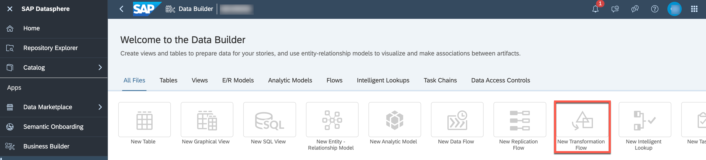  

4. You see the Transformation Flow editor with options to define view transformation and create a new table.
 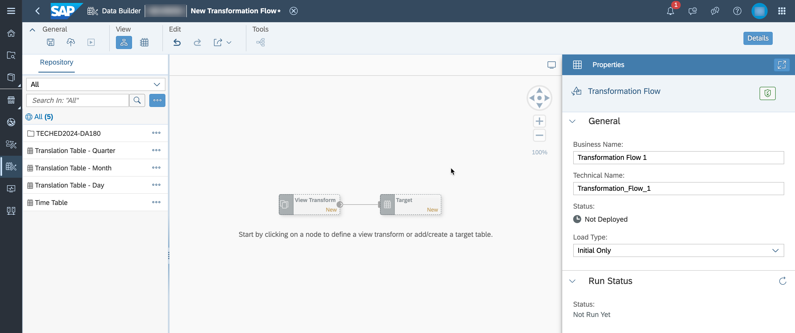  

5. Click on the ***View Transform*** node and select the ***Graphical View Transform*** option.
 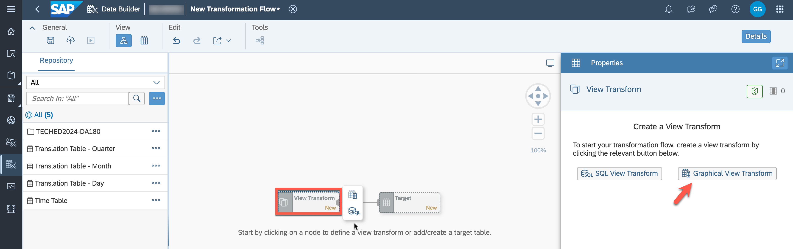  

6. Drag and drop the table ***TECHED2024_SALES_TRANSACTIONS*** into the editor. The details on the right-hand side display that this shared table is capturing delta. (If you don't see this table, ensure that you are in the ***Graphical View Editor***.)
 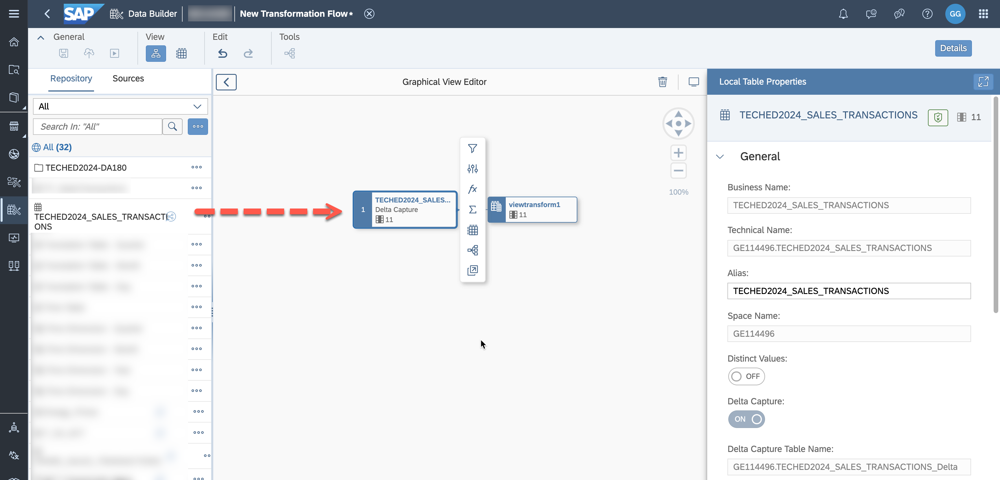  

7. If you scroll down, ensure that ***Load from Table*** is set to ***Delta Capture***. As the delta capture setting is enabled for the source table, the columns ***Change Date*** and ***Change Type*** are automatically mapped to these columns in the target table. Mapping these columns (or a calculated column that contains the content of these columns) to any other target column is not permitted. 
 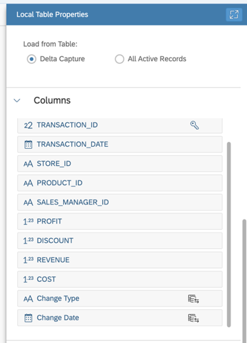  

8. Add a new node for ***Calculated Columns***. Choose the existing column ***STORE_ID*** and enter the expression ***RIGHT(STORE_ID,6)*** as we will exclude the prefix of the STORE_ID so that it can be mapped to the dimension IDs. Adjust the length to 6 characters.
   

9. Exit the graphical view editor and go back to the transformation flow overview.
 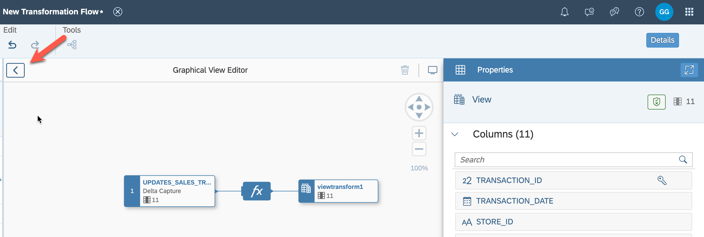  

10. Click on ***Create New Target Table***.
 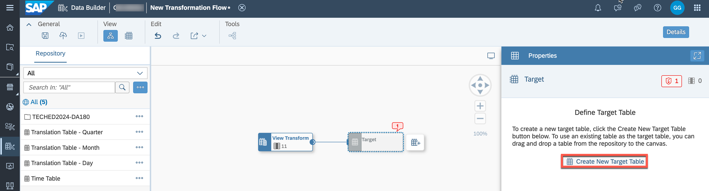  

11. Set the business name to ***TRANSFORMED_TECHED2024_SALES_TRANSACTIONS***. Verify that ***Delta Capture*** is turned on.
 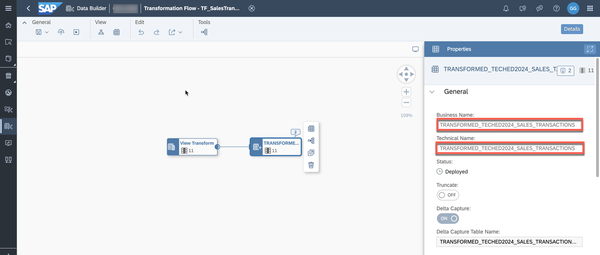  

12. Deselect the target table by clicking somewhere else in the editor field. The properties for the Transformation Flow will appear on the right-hand side. Set the business name to ***TF_SalesTransactions*** and the Load Type to ***Initial and Delta***.
 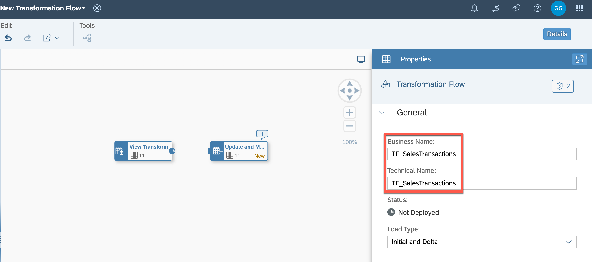  

13. Save and deploy the Transformation Flow in the folder TECHED2024-DA180, afterward click on ***Run***.
 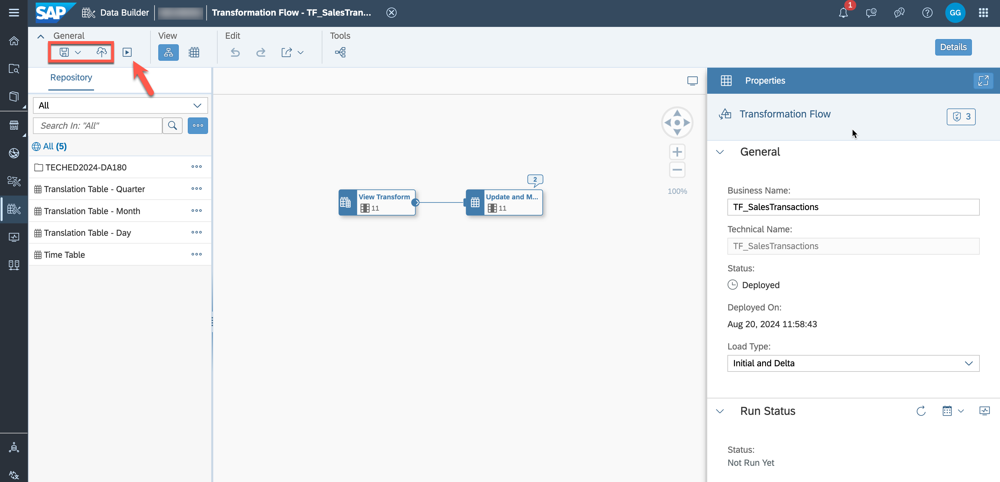  

14. Open the Data Integration Monitor to have a look at the Transformation Flow run.
 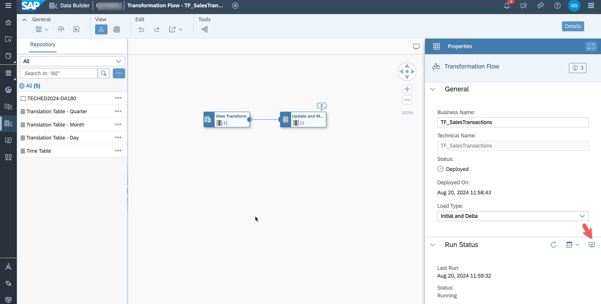

15. The Data Integration Monitor details display of the Transformation Flow run. Have a look at the messages and the section ***Metrics*** to check the number of processed records.
 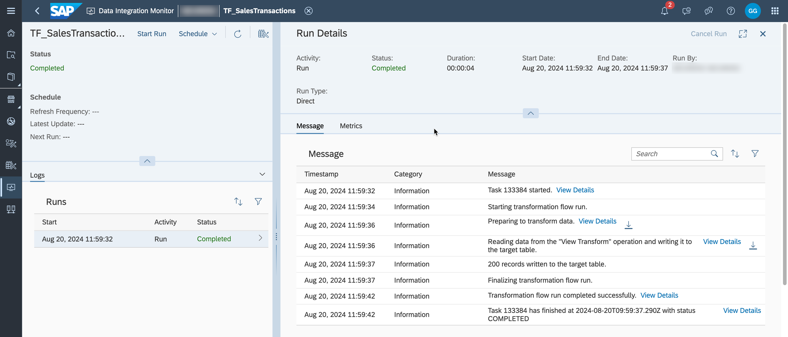  

16. The Transformation Flow run should run scheduled. User consent is required to run scheduled tasks or task chains. Authorize SAP Datasphere to run these tasks.
 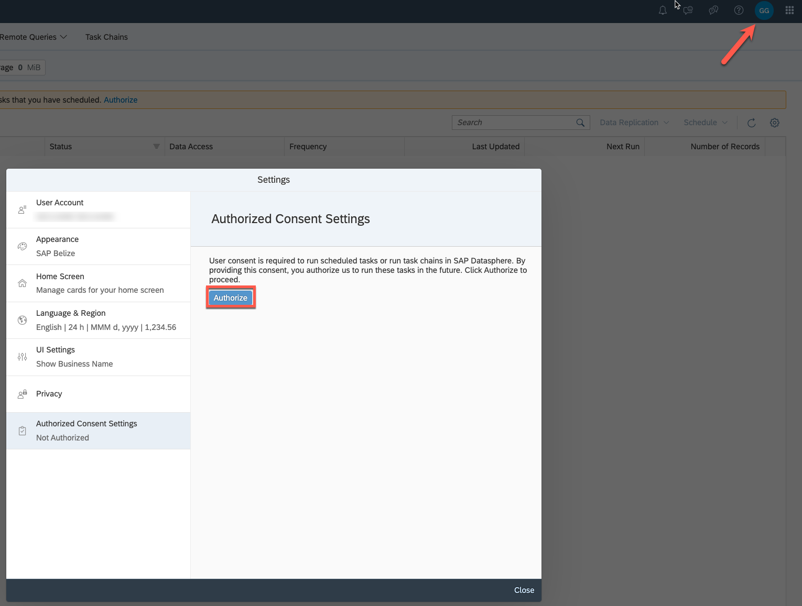  

17. Schedule the Transformation Flow to run once a day. It will retrieve the newest and changed records and add them to the local table. Click ***Create Schedule***.
 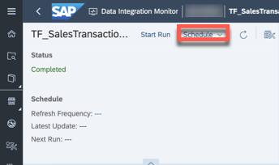  

18. Define the scheduling as ***Simple Schedule*** which is repeated every 10 minutes. Choose a time and select ***Create***.
 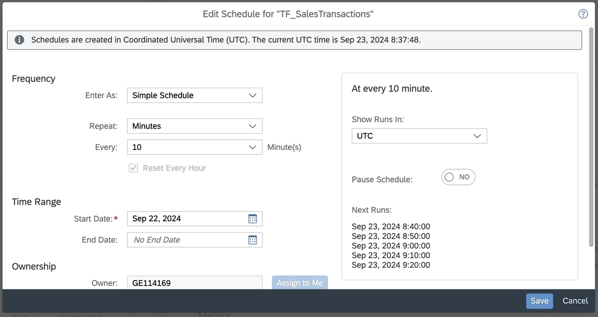  

19. You can go back to this monitor after new runs to see that new records are written to the target table.
 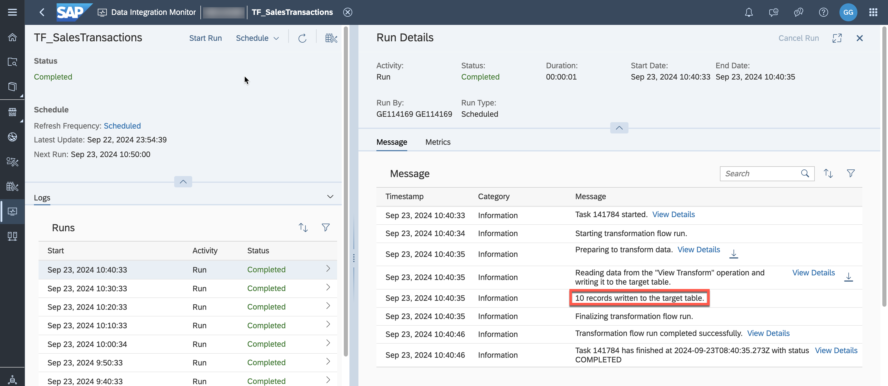  

20. The Analytic Model used until now (Sales__Analytic_Model) is based on data of local tables. We will copy the fact model and replace the source so that the sales transaction data is coming from the table updated via the transformation flow instead of data imported once via CSV. Copy the view ***Sales View - Fact***. Name it ***Sales View - Fact (Updated)***.
 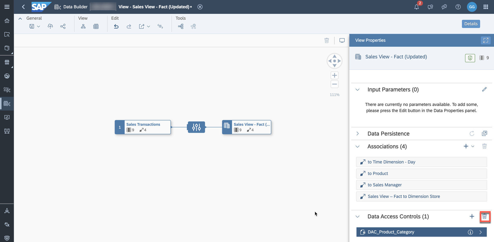  

---
>:bulb: **Tip:** We create a copy of the fact view (and Analytic Model & SAC story) to preserve the previously created models based on the CSV files. You will copy the existing SAC story and replace the model so that you don't need to recreate a full story. Another option would also be switching the source table of the currently used fact view so that the updated records are displayed in the already existing SAC story. 
---

21. Open the copied view ***Sales View - Fact (Updated)***. If you previously did the exercise about data access controls, the view does not look as displayed on the screenshot. Remove the join with ***ProductDim_DAC*** and the assigned DAC.
   

22. Drag and drop the table ***TECHED2024_SALES_TRANSACTIONS*** into the canvas and replace the original source table. 
 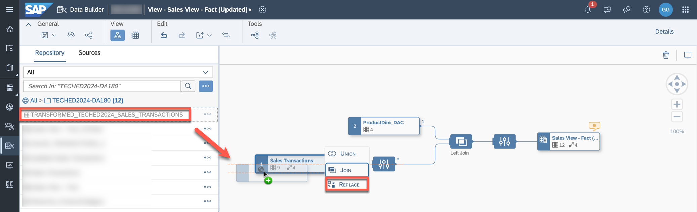  

23. Map the columns from the old source to the new source by dragging them from the left to the right side. Ensure that all nine columns are mapped and click ***Replace***.
 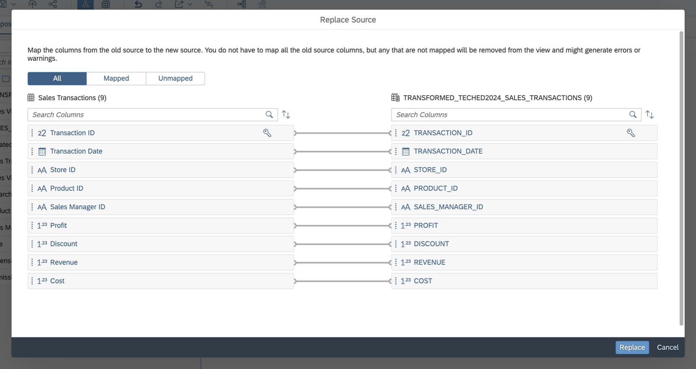  

24. Now the source table is replaced with the local table which is enabled for delta capture. Ensure that the view validation of ***Sales View - Fact (Updated)*** displays a green status.
   

25. Save and deploy ***Sales View - Fact (Updated)***.

26. Select ***Create Analytic Model*** (in the view properties of ***Sales View - Fact (Updated)***).
 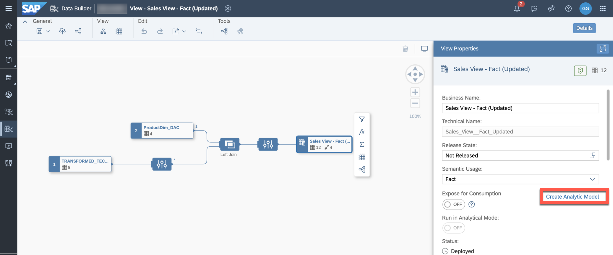  

27. When creating an updated data model, it is likely that measure or attribute names change. To simulate this, select the measure ***Revenue*** and adjust the business and technical name to ***Updated_Revenue***. 
  

28. Save the Analytic Model as ***Sales - Analytic Model (Updated)*** and deploy it. Confirm "Renaming measure technical name might affect existing stories". The Analytic Model is now accessing delta enabled local table which is receiving updated records. 
We will reuse the previously created SAC Story and map it to the new updated Analytic Model so that the report displays the incoming sales transactions.

29. Use the product switch button in the upper right corner to switch to SAC.
 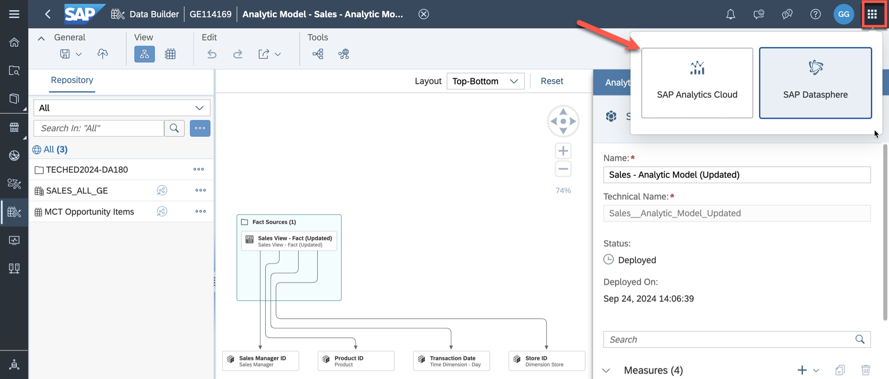  

30. Switch to the ***Files*** application and copy the previously created story ***Revenue Analysis - Products*** to keep the previously created story as a backup. Copy it to the same folder and name it ***Revenue Analysis - Products (Updated)***.
 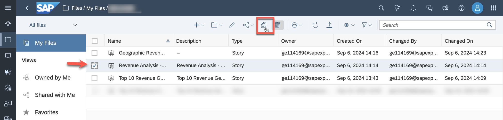  

31. Open the story  ***Revenue Analysis - Products (Updated)*** and switch to the ***Edit*** mode.

32. To replace the model, access ***...*** -> ***Sales__Analytic_Model*** -> ***Replace***.
 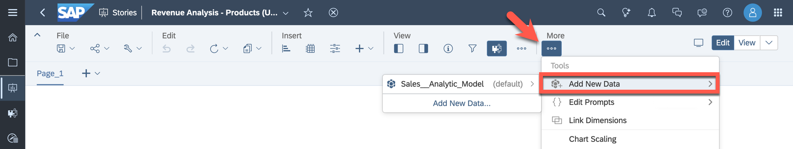  

33. Read the warning displayed and click ***Continue***.
 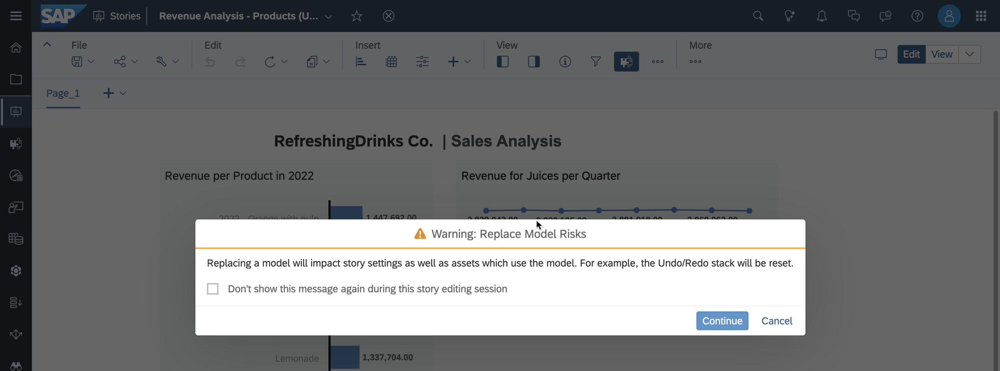  

34. Select ***select other model***. You can replace a model in your SAC story with another compatible model, an Analytic Model can be replaced with a different Analytic Model. Choose the connection ***DATASPHERE*** and click on the folder with your user's ID. Select the folder ***TECHED2024-DA180*** and click on the Analytic Model ***Sales - Analytic Model (Updated)***.

35. The replace model dialog displays the objects from the replacement model and the objects that need to be mapped (only objects used in the story are mapped). Some objects will automatically be mapped if they are similar to the original objects or if they are mandatory objects. Then they will be disabled (greyed out) in this panel. Map the measure ***Updated_Revenue*** to ***Revenue***. Check that the mappings are done correctly like displayed in the screenshot.
 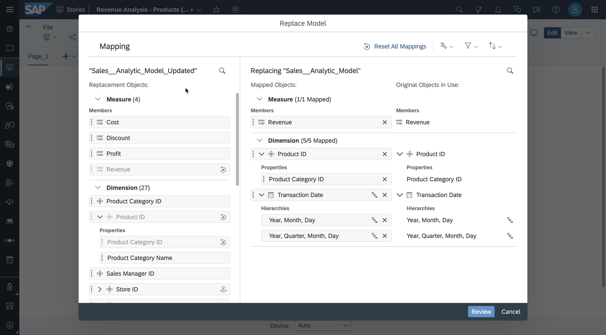

36. When you have finished mapping objects, select ***Review***. Verify that no issues have been found and click ***Replace Model***.
 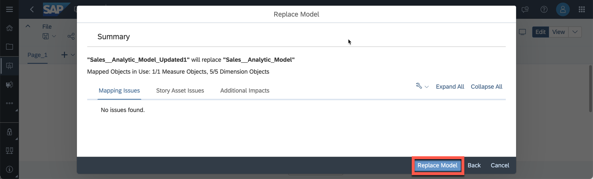

37. The story now accesses data from the new source. The filter for revenue per product is set to 2022. As there is no data available for this year, now data is displayed. We will modify the story in the next steps.
 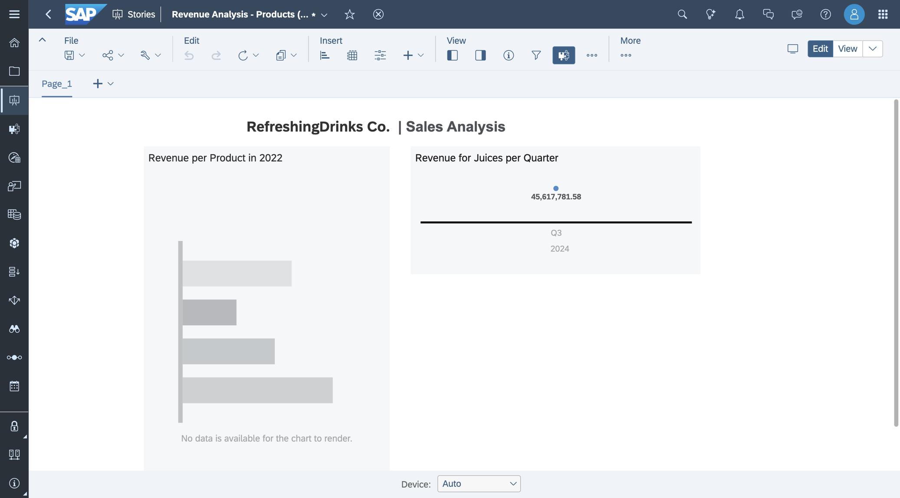

38. Select the chart ***Revenue per Product*** and remove the filter set for ***Transaction Date***.
 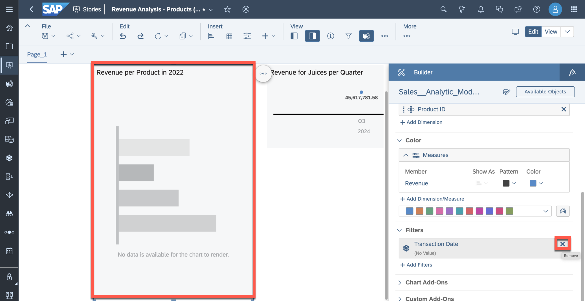

39. The revenue per product is displayed.
 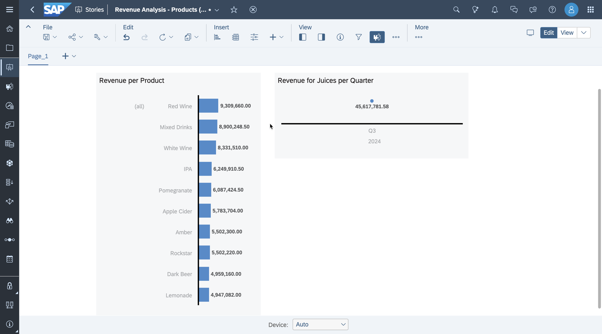

40. We would like to receive a daily summary of recent sales of juices from the past few days. Drill down on the transaction date until it is based on days (click twice on the ***Drill Down*** button).
 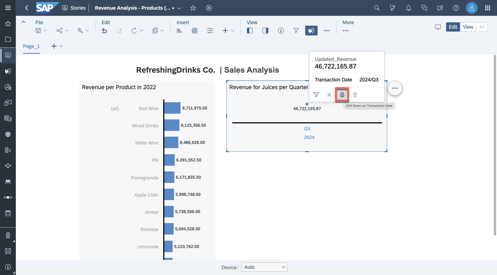

41. Save the story. You are asked if you want to remove the unused model, select ***Remove data source***.

42. Your final report dynamically displays the most recent beverage sales, allowing you to analyze the changes in revenue from sold juices over the past few days.
 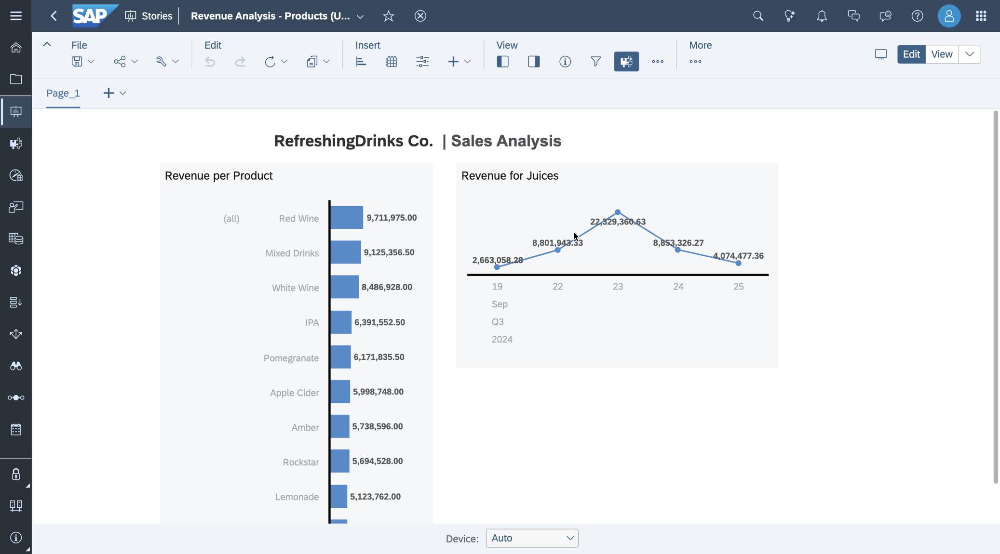

## Summary

You have now created and deployed your first transformation flow to transform and access changing records in a scheduled approach. You replaced the data source while keeping the story structure and format intact.

You can continue with one of the optional exercises:
- [Exercise 20: Identify Top-Performing Sales Managers with Just Ask](../ex20/README.md)
- [Exercise 21: Create Row-Level Permissions based on External Hierarchy](../ex21/README.md)
- [Exercise 22: Explore the Analytic Model](../ex22/README.md)
